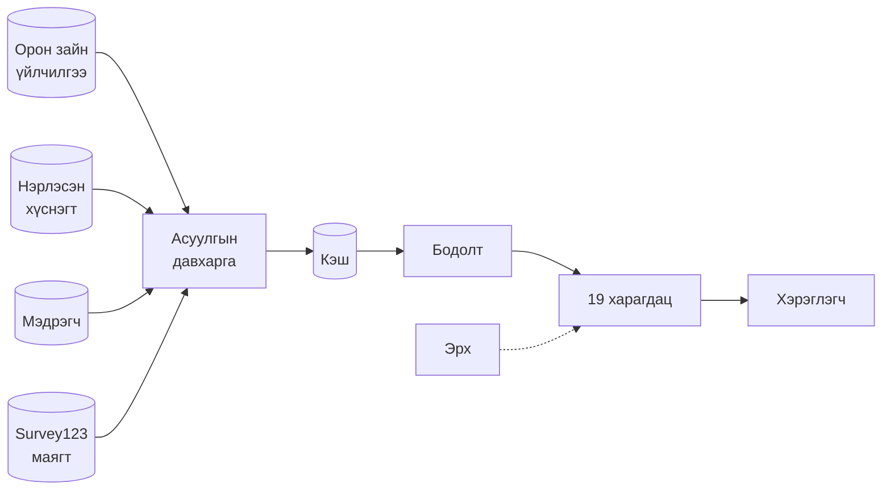

# Сэлбэ портал — Системийн баримт

Сэлбэ дэд төвийн барилгын төслийн мэдээллийг нэг дэлгэцэд нэгтгэдэг
орон зайн мэдээллийн портал.

Энэ баримт нь **портал хэрхэн ажилладгийг** тайлбарлана: тоо хаанаас гардаг,
хэзээ шинэчлэгддэг, хэн юуг засах эрхтэй.

**Уншигч:** шийдвэр гаргагч, захиргаа. Код бичих шаардлагагүй.

---

## ⚠️ Энэ баримт ЮУ БИШ бэ

Порталын дотор **«Үйл ажиллагааны схем»** нэртэй харагдац бий. Тэр нь
**барилгын төслийн** ажлын урсгалыг зурдаг:

> Төлөвлөлт → Зөвшөөрөл / Газар → Хуваарь → Барилга → Хяналт → Санхүү → Тайлан

өөрөөр хэлбэл **төсөл хэрхэн явдгийг**.

Харин энэ баримт нь **програм хэрхэн ажилладгийг** тайлбарлана. Хоёр өөр зүйл.

Тэр харагдацын тухай: [04 §2.6](system/04-haragdac.md#schem).

---

## Танд ямар асуулт байна вэ?

| Асуулт | Хаана |
|---|---|
| «Энэ тоо хаанаас гарав?» | [02 · Өгөгдлийн эх сурвалж](system/02-ogogdliin-esurvalj.md) |
| «Гүйцэтгэлийн хувь яаж бодогддог вэ?» | [04 §2.3](system/04-haragdac.md#pkgprog) |
| «Санхүүжилтийн аль тоо үнэн бэ?» | [02 §3](system/02-ogogdliin-esurvalj.md) · [06 §6](system/06-toonii-dursam.md) |
| «Яагаад график дунд цоорхойтой вэ?» | [06 §2](system/06-toonii-dursam.md) |
| «Би бөглөсөн, хэзээ харагдах вэ?» | [03 §5](system/03-ogogdliin-zam.md) |
| «Хэн юуг засах эрхтэй вэ?» | [05](system/05-erh-batlah.md) |
| «Яагаад би энийг харахгүй байна вэ?» | [05 §2–3](system/05-erh-batlah.md) |
| «Яагаад энэ тоо тэр дэлгэцтэй зөрөв?» | [08 §6](system/08-hyzgaarlalt.md) |
| «Бүсийн шүүлт яагаад ажиллахгүй вэ?» | [08 §1](system/08-hyzgaarlalt.md) |

---

## Системийн нэг харц

---

## Бүлгүүд

| # | Файл | Тухай |
|---|---|---|
| 01 | [Систем юу хийдэг вэ](system/01-yu-hiideg.md) | Зорилго, хэрэглэгчид, системийн хил |
| 02 | [Өгөгдлийн эх сурвалж](system/02-ogogdliin-esurvalj.md) | ArcGIS үйлчилгээ бүр — **«тоо хаанаас гарав» гэсэн асуултын үндэс** |
| 03 | [Тооны зам](system/03-ogogdliin-zam.md) | Эх сурвалжаас дэлгэц хүртэлх механизм, 13 удирдлагын үзүүлэлт |
| 04 | [Харагдацууд](system/04-haragdac.md) | Харагдац бүр юунд хариулдаг, тоо нь яаж гардаг |
| 05 | [Эрх ба батлах](system/05-erh-batlah.md) | Хэн юуг засах эрхтэй, батлах урсгал, бичилтийн эрсдэл |
| 06 | [Тоог зөв ойлгох](system/06-toonii-dursam.md) | **7 дүрэм** — буруу уншвал буруу шийдвэр гарна |
| 07 | [Гадаад холболт](system/07-gadaad-erschim.md) | Асистент, Telegram бот, мэдрэгч |
| 08 | [Хязгаарлалт](system/08-hyzgaarlalt.md) | Мэдэгдэж буй цоорхой, хаана тоо зөрөх нь хэвийн |

⚠️ Хэрэв нэг л бүлэг уншина гэвэл — **[06 · Тоог зөв ойлгох](system/06-toonii-dursam.md)**.
Долоон дүрэм нь дэлгэц дээрх бүх тоонд хамаарна.

---

## Энэ репод байгаа бусад баримт

| Файл | Тухай |
|---|---|
| [`CLAUDE.md`](../CLAUDE.md) | Хөгжүүлэлтийн ажлын дүрэм — архитектур биш |
| [`DATA_DICTIONARY.md`](../DATA_DICTIONARY.md) | ArcGIS давхаргын **талбарын** толь (талбарын нэр, нэгж, өртгийн загвар) |
| [`bagts-guitsetgel-negtgel.md`](bagts-guitsetgel-negtgel.md) | Батлагдсан гүйцэтгэлийн **нэг хүснэгтийн** гүн баримт |
| `SELBE_BNBD_NORMS.md` | БНБД 30-01-24 нормын эшлэл, босго утга |

---

## Баримтыг хэрхэн шинэчлэх вэ

Код өөрчлөгдөхөд энэ баримт хоцрох эрсдэлтэй. Тиймээс автомат шалгуур
(`docs/docs.invariant.check.mjs`) `npm test`-ийн хамт ажиллаж, дараахыг
кодтой тулгана:

- 19 харагдац бүгд баримтад бий эсэх (хоёр талдаа)
- Өгөгдлийн түлхүүрүүд таарч байгаа эсэх
- Удирдлагын үзүүлэлтийн тоо
- Диаграм хэт том болоогүй эсэх
- Дотоод холбоос эвдрээгүй эсэх

⚠️ Шалгуур нь **бүтцийг** хамгаална, тайлбарын агуулгыг биш. Файл бүрийн
төгсгөлд «юу автоматаар шалгагддаг, юу гарын итгэл вэ» гэж бичигдсэн байна.

---

**Хамгийн сүүлд шинэчилсэн:** 2026-09-16
**Хамрах хүрээ:** ~128 мянган мөр код · 20 харагдац · 174 давхарга (2026-09-16)
