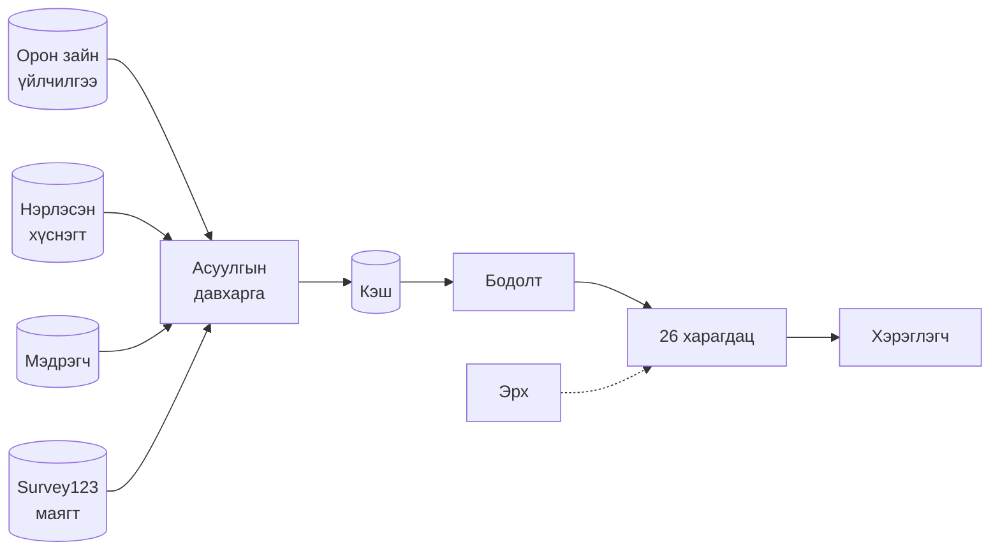

# Сэлбэ портал — Системийн баримт

Сэлбэ дэд төвийн барилгын төслийн мэдээллийг нэг дэлгэцэд нэгтгэдэг
орон зайн мэдээллийн портал.

Энэ баримт нь **портал хэрхэн ажилладгийг** тайлбарлана: тоо хаанаас гардаг,
хэзээ шинэчлэгддэг, хэн юуг засах эрхтэй.

**Уншигч:** шийдвэр гаргагч, захиргаа. Код бичих шаардлагагүй.

---

## ⚠️ Энэ баримт ЮУ БИШ бэ

Порталын дотор **«Үйл ажиллагааны схем»** нэртэй харагдац бий. Тэр нь
**барилгын төслийн** ажлын урсгалыг зурдаг:

> Төлөвлөлт → Зөвшөөрөл / Газар → Хуваарь → Барилга → Хяналт → Санхүү → Тайлан

өөрөөр хэлбэл **төсөл хэрхэн явдгийг**.

Харин энэ баримт нь **програм хэрхэн ажилладгийг** тайлбарлана. Хоёр өөр зүйл.

Тэр харагдацын тухай: [04 §2.6](system/04-haragdac.md#schem).

---

## Танд ямар асуулт байна вэ?

| Асуулт | Хаана |
|---|---|
| «Энэ тоо хаанаас гарав?» | [02 · Өгөгдлийн эх сурвалж](system/02-ogogdliin-esurvalj.md) |
| «Гүйцэтгэлийн хувь яаж бодогддог вэ?» | [04 §2.3](system/04-haragdac.md#pkgprog) |
| «Санхүүжилтийн аль тоо үнэн бэ?» | [02 §3](system/02-ogogdliin-esurvalj.md) · [06 §6](system/06-toonii-dursam.md) |
| «Яагаад график дунд цоорхойтой вэ?» | [06 §2](system/06-toonii-dursam.md) |
| «Би бөглөсөн, хэзээ харагдах вэ?» | [03 §5](system/03-ogogdliin-zam.md) |
| «Хэн юуг засах эрхтэй вэ?» | [05](system/05-erh-batlah.md) |
| «Яагаад би энийг харахгүй байна вэ?» | [05 §2–3](system/05-erh-batlah.md) |
| «Яагаад энэ тоо тэр дэлгэцтэй зөрөв?» | [08 §6](system/08-hyzgaarlalt.md) |
| «Бүсийн шүүлт яагаад ажиллахгүй вэ?» | [08 §1](system/08-hyzgaarlalt.md) |

---

## Системийн нэг харц

```mermaid
flowchart LR
  SPACE[(Орон зайн<br/>үйлчилгээ)] --> Q[Асуулгын<br/>давхарга]
  TABLE[(Нэрлэсэн<br/>хүснэгт)] --> Q
  IOT[(Мэдрэгч)] --> Q
  FORM[(Survey123<br/>маягт)] --> Q
  Q --> CACHE[(Кэш)]
  CACHE --> CALC[Бодолт]
  CALC --> VIEW[26 харагдац]
  VIEW --> USER[Хэрэглэгч]
  ACL[Эрх] -.-> VIEW
```

---

## Бүлгүүд

| # | Файл | Тухай |
|---|---|---|
| 01 | [Систем юу хийдэг вэ](system/01-yu-hiideg.md) | Зорилго, хэрэглэгчид, системийн хил |
| 02 | [Өгөгдлийн эх сурвалж](system/02-ogogdliin-esurvalj.md) | ArcGIS үйлчилгээ бүр — **«тоо хаанаас гарав» гэсэн асуултын үндэс** |
| 03 | [Тооны зам](system/03-ogogdliin-zam.md) | Эх сурвалжаас дэлгэц хүртэлх механизм, 13 удирдлагын үзүүлэлт |
| 04 | [Харагдацууд](system/04-haragdac.md) | Харагдац бүр юунд хариулдаг, тоо нь яаж гардаг |
| 05 | [Эрх ба батлах](system/05-erh-batlah.md) | Хэн юуг засах эрхтэй, батлах урсгал, бичилтийн эрсдэл |
| 06 | [Тоог зөв ойлгох](system/06-toonii-dursam.md) | **7 дүрэм** — буруу уншвал буруу шийдвэр гарна |
| 07 | [Гадаад холболт](system/07-gadaad-erschim.md) | Асистент, Telegram бот, мэдрэгч |
| 08 | [Хязгаарлалт](system/08-hyzgaarlalt.md) | Мэдэгдэж буй цоорхой, хаана тоо зөрөх нь хэвийн |

⚠️ Хэрэв нэг л бүлэг уншина гэвэл — **[06 · Тоог зөв ойлгох](system/06-toonii-dursam.md)**.
Долоон дүрэм нь дэлгэц дээрх бүх тоонд хамаарна.

---

## Чанарын баримт (2026-09-28, шинэчлэв 2026-09-25 аудит 8)

Нэг хүснэгт `Selbe_Chanar_Barimt`, `turul` талбараар **7 төрөл** (`chanarMs.KINDS`):

| Төрөл | Юу | Хянагч (`REVIEWERS_OF`) | Урсгал |
|---|---|---|---|
| MS | Ажлын аргачлал | ТУХ · Чанар · ХАБЭА (зэрэг) | гүйцэтгэгч ирүүлнэ → хянагч бүр шийднэ |
| QMP | Чанарын удирдлагын төлөвлөгөө | MS-тэй ижил | MS-тэй ижил бие, ижил урсгал |
| PRC | Процедур | MS-тэй ижил | MS-тэй ижил бие, ижил урсгал |
| MA | Материал баталгаажуулалт | **ЧХ инженер → Чанар → ТУГ (дараалсан)** | «Боловсруулсан — ЧХ хяналтын инженер · Зөвшөөрсөн — ЧХ менежер · Танилцсан — ТУГ ТМ»; материал бүрд тусдаа шийдвэр байж болно; батлагдсанаас ч шинэ хувилбар (нийлүүлэгч солих) |
| MIR | Материалын үзлэг | ТУХ, **дараа нь** Чанар (дараалсан) | гүйцэтгэгч «гүйцэтгэгч» баганыг, ТУХ «захиалагч» баганыг бөглөнө |
| FIC | Талбайн үзлэг | ТУХ, **дараа нь** Чанар | MIR-тэй ижил, 3 загвар |
| NCR | Үл тохирол | ТУХ · Чанар · ТУГ (зэрэг, залруулгын дараа) | **захиалагч (ТУХ / Чанар / ТУГ) нээнэ** → гүйцэтгэгч залруулга илгээнэ → гурав хаана / дахин засах; rev үгүй, дахин нээж болно |

- Хянагчийн үүрэг (`chanarAcl`): `tuh` · `chanar` (ЧХ менежер) · `habea` · `tug` · `cheng` (ЧХ хяналтын инженер, MA-ийн эхний шат) —
  аль нь болохыг багцын хуваарилалт (`chanarReview`) заана; `chanarAuthor` — гүйцэтгэгч.
  Зохиогч өөрийн баримтаа хянахгүй; дараалсан төрөлд дараагийн хянагч өмнөх нь шийдсэний дараа л үйлдэл хийнэ.
- Шийдвэр: **A** (зөвшөөрсөн) · **AN** (санал бүхий зөвшөөрсөн, текст заавал) · **R** (татгалзсан).
  Аль нэг R → буцаагдсан (rev+1, `revNote` заавал); бүгд A/AN → батлагдсан. Шийдвэр бүр огноотой (`hyanalt` JSON).
- Батлагдсан/буцаагдсан болмогц захиалагчийн хариу **REP** дугаар:
  `SLB-REP-<төрөл>-P<багц>-<NNNN>-<RR>` — NNNN нь төслийн хэмжээний нэг дараалал (төрөл тус бүр), **RR = тухайн баримтын
  хариуны тоо** (0098-00 → 0098-01 rev+1 бүрд). REP-гүй буцаалт (`bounce`) — зөвхөн зохиогчид.
- Баримтын дугаар `<гүйц>-SLB-<төрөл>-P<багц>-<№>-<rev>` — төрөл бүр өөрийн дараалалтай, гараар орохгүй.
  **NCR — `STMCC-STMC-NCR-NNNN`**: захиалагч нээдэг тул гүйцэтгэгчийн код үгүй, багцгүй, төслийн хэмжээний нэг дараалал.
- Холбоос: «Чанар (QAQC)»-ийн MA · MIR · FIC дугаарын нүдэнд тухайн багцын батлагдсан баримтаас сонгож болно (чөлөөт текст хэвээр).
- Эрхийн тойм (`erhOverview`): хянагчийн үүрэг дутуу багц **шар** (`warn`) — үүрэг бүр зөвхөн өөрийн төрлийн баримтыг гацаана
  (ХАБЭА зөвхөн MS-төрөл, ТУГ — MA · NCR, ЧХ инженер — MA).

Дэлгэрэнгүй: `src/lib/chanarMs.ts` (дүрэм), `src/lib/chanarStore.ts` (бичилт), [05 · Эрх ба батлах](system/05-erh-batlah.md).

---

## Энэ репод байгаа бусад баримт

| Файл | Тухай |
|---|---|
| [`CLAUDE.md`](../CLAUDE.md) | Хөгжүүлэлтийн ажлын дүрэм — архитектур биш |
| [`reference/DATA_DICTIONARY.md`](reference/DATA_DICTIONARY.md) | ArcGIS давхаргын **талбарын** толь (талбарын нэр, нэгж, өртгийн загвар) |
| [`bagts-guitsetgel-negtgel.md`](bagts-guitsetgel-negtgel.md) | Батлагдсан гүйцэтгэлийн **нэг хүснэгтийн** гүн баримт |
| [`reference/SELBE_BNBD_NORMS.md`](reference/SELBE_BNBD_NORMS.md) | БНБД 30-01-24 нормын эшлэл, босго утга |

---

## Баримтыг хэрхэн шинэчлэх вэ

Код өөрчлөгдөхөд энэ баримт хоцрох эрсдэлтэй. Тиймээс автомат шалгуур
(`docs/docs.invariant.check.mjs`) `npm test`-ийн хамт ажиллаж, дараахыг
кодтой тулгана:

- Бүх харагдац (одоо 25) баримтад бий эсэх (хоёр талдаа) — тоог кодоос уншина
- Гүйцэтгэлийн урсгалын шатны тоо (одоо 6) баримттай зөрөөгүй эсэх
- Өгөгдлийн түлхүүрүүд таарч байгаа эсэх
- Удирдлагын үзүүлэлтийн тоо
- Диаграм хэт том болоогүй эсэх
- Дотоод холбоос эвдрээгүй эсэх

⚠️ Шалгуур нь **бүтцийг** хамгаална, тайлбарын агуулгыг биш. Файл бүрийн
төгсгөлд «юу автоматаар шалгагддаг, юу гарын итгэл вэ» гэж бичигдсэн байна.

---

**Хамгийн сүүлд шинэчилсэн:** 2026-10-09
**Хамрах хүрээ:** ~169 мянган мөр код · 26 харагдац · 6 шатат хяналт (2026-09-30)
