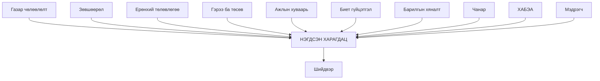

# 01 · Систем юу хийдэг вэ

---

## 1. Гурван өгүүлбэрээр

Сэлбэ портал нь **Сэлбэ дэд төвийн барилгын төслийн** мэдээллийг нэг
дэлгэцэд нэгтгэдэг.

Төсвөөс эхлээд газар чөлөөлөлт, ажлын хуваарь, биет гүйцэтгэл, чанар,
аюулгүй байдал хүртэлх арван орчим тусдаа бүртгэлийг **газрын зурагтай
холбож** харуулна.

Зарим хэсэгт нь шууд бөглөж, батлуулах боломжтой.

---

## 2. Хэн ашигладаг вэ

| Хэрэглэгч | Юунд ашигладаг |
|---|---|
| **Удирдлага** | Төслийн ерөнхий байдал, хоцрогдол, эрсдэлийг хурдан харах |
| **Төслийн менежер** | Багц бүрийн санхүү, гүйцэтгэл, хуваарийг хянах |
| **Гүйцэтгэгч** | Өдөр тутмын гүйцэтгэлээ бөглөж илгээх |
| **Хяналтын инженер** | Илгээсэн гүйцэтгэлийг шалгаж зөвшөөрөх, буцаах |
| **Захиргаа** | Эрх олгох, багц хуваарилах |

---

## 3. Систем юуг нэгтгэдэг вэ

Эдгээр нь **өмнө нь тус тусдаа** байсан бүртгэлүүд. Порталын гол үнэ цэн нь
тэдгээрийг нэг газар, нэг шүүлтээр харуулахад оршино.

---

## 4. Гурван төрлийн дэлгэц

| Төрөл | Зорилго | Жишээ |
|---|---|---|
| **Тойм** | Нэг харцаар байдлыг мэдэх | Ерөнхий дашбоард · Үйл ажиллагааны схем |
| **Судлах** | Асуулт тавьж, задалж үзэх | Төслийн дэлгэрэнгүй · Санхүүжилт · Багцын гүйцэтгэл |
| **Бөглөх** | Өгөгдөл оруулж илгээх | Гүйцэтгэл · Хуваарь · Чанар · Зөвшөөрөл |

⚠️ Бөглөх дэлгэцүүд нь **эрхээр хамгаалагдсан** — багцад томилогдсон
хэрэглэгч л бөглөнө ([05](05-erh-batlah.md)).

---

## 5. Системийн ХИЛ — юуг хийдэггүй вэ

> ⚠️ **Портал нь бүртгэлийн систем БИШ.**

Бүх өгөгдөл **ArcGIS**-д хадгалагдана. Портал бол **харагдац** бөгөөд
хязгаарлагдмал хэсэгт нь бөглөх цонх.

Үүнээс үүдэх практик дүгнэлтүүд:

| Асуулт | Хариу |
|---|---|
| «Тоо буруу байна» | Ихэвчлэн эх сурвалжийн асуудал. [02](02-ogogdliin-esurvalj.md)-оос эх сурвалжийг олж, тэндээ шалгана |
| «Энэ талбар байхгүй» | Эх сурвалжид байхгүй бол порталд гарах боломжгүй |
| «Өгөгдөл устгамаар байна» | Портал устгах үйлдэл маш хязгаарлагдмал — ArcGIS талаас хийнэ |
| «Шинэ талбар нэмье» | Эх сурвалжид эхлээд нэмэгдэнэ, дараа нь портал харуулна |

Мөн портал нь:
- **Гэрээ байгуулдаггүй** — гэрээний бүртгэлийг гаднаас авна
- **Төлбөр гүйцэтгэдэггүй** — олгосон санхүүжилтийг гаднаас уншина
- **Норм тогтоодоггүй** — БНБД-ийн үнэлгээг зөвхөн тооцоолно

---

**Дараагийн алхам:** [02 · Өгөгдлийн эх сурвалж](02-ogogdliin-esurvalj.md)

---

**Хамгийн сүүлд шинэчилсэн:** 2026-09-16
**Автомат шалгуур:** [`docs/docs.invariant.check.mjs`](../docs.invariant.check.mjs) (Ш5)
**Гараар шалгах:** хэрэглэгчийн үүргийн жагсаалт
