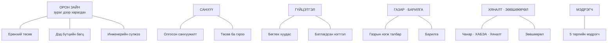

# 02 · Өгөгдлийн эх сурвалж

Порталын **бүх тоо** ArcGIS-ээс ирдэг. Портал өөрөө өгөгдөл хадгалдаггүй.
Тиймээс «энэ тоо хаанаас гарав?» гэсэн асуултын хариу үргэлж энэ файлд байна.

Кодын ганц эх сурвалж: [`src/lib/services.ts`](../../src/lib/services.ts)

---

## 1. Зургаан ангилал

⚠️ Энэ зураг дээр **одоо ажиллаж байгаа** эх сурвалж л байна.
Хаалттай болсон хоёрыг §9-өөс үзнэ үү.

---

## 2. Орон зайн үйлчилгээ — газрын зураг дээр харагдах бүхэн

### 2.1 Ерөнхий төсөв (`ET`)

**Төслийн үндсэн зураглал.** 29 давхарга: зам, ногоон байгууламж, инженерийн
бэлтгэл, гүүр, талбай.

Кодын ганц эх сурвалж: `services.ts` → `ET`
Хэн уншдаг: бараг бүх газрын зурагтай харагдац
Хэн бичдэг: ХЭН Ч ҮГҮЙ — портал зөвхөн уншина

Талбар бүрийн утга: [`DATA_DICTIONARY.md`](../../DATA_DICTIONARY.md)

⚠️ **Нэгж үнэ идэвхтэй засагдаж байна.** 2026-07-21-нд нэг өдрийн дотор
олон давхаргын үнэ өөрчлөгдсөн. Тиймээс өртгийн тоог «тогтсон» гэж үзэж
болохгүй — хэзээ хэмжсэнээ тэмдэглэ.

### 2.2 Дэд бүтцийн багц (`ET_PKG`)

**62 давхарга** — Багц 5-аас 21 хүртэл. `ET`-ийн шинэ хувилбар **БИШ**,
агуулга нь огт өөр: энд ажил нь багцаар задарсан.

Давхарга бүр багцын нэрийн талбартай тул гэрээний бүртгэлтэй шууд таарна.

Кодын ганц эх сурвалж: `services.ts` → `ET_PKG`
Хэн уншдаг: багцын харагдацууд, дэд бүтэц

### 2.3 Инженерийн сүлжээ (`INFRA_SVC`)

**73 давхарга, 8,419 обьект.** Багц бүр бүрэлдэхүүнээрээ задарсан — жишээ нь
Багц 5.1 нь дулааны өгөх/буцах, халуун ус өгөх/буцах, хүйтэн ус, бохир шугам,
худаг, лотки, ДХТ гэж 10 давхарга болно.

Кодын ганц эх сурвалж: `services.ts` → `INFRA_SVC`
Хэн уншдаг: «Инженерийн дэд бүтэц» харагдац

> ⚠️ **Бүсийн шүүлт ЭНД АЖИЛЛАХГҮЙ.** Бүсийн дугаарын талбар энэ үйлчилгээний
> 73 давхаргын **аль нэгэнд нь ч байхгүй**. Тиймээс порталын нэгдсэн бүсийн
> шүүлт эдгээр давхаргад **үйлчлэхгүй** — бүс сонгосон ч бүгд харагдана.
> Энэ нь алдаа биш, өгөгдлийн бодит байдал. Дэлгэрэнгүй: [08 §1](08-hyzgaarlalt.md).

### 2.4 Нэгдсэн орон зайн үйлчилгээ (`TD`)

109 давхарга. Газар чөлөөлөлт, барилга, эх үүсвэр зэрэг холимог агуулгатай.

⚠️ `INFRA_SVC`-тэй **нэг хост дээр** байдаг — тиймээс нэг нь ажиллахгүй бол
нөгөө нь ч ихэвчлэн ажиллахгүй.

---

## 3. Санхүүгийн хоёр хүснэгт — ХОЛИХГҮЙ

Порталын хамгийн их андуурал энэ хоёрын хооронд гардаг.

### 3.1 Олгосон санхүүжилт (`HO_IPC`)

**Нэг мөр = НЭГ ТӨЛБӨРИЙН БИЧИЛТ.** Бодитоор олгогдсон мөнгө.

Кодын ганц эх сурвалж: `services.ts` → `HO_IPC`
Хэн уншдаг: багцын санхүү · санхүү · ерөнхий дашбоард · тайлан · удирдлагын үзүүлэлт
Хэн бичдэг: гадаад бүртгэлээс. Портал зөвхөн **холбоосыг** нөхөж бичдэг
(аль төлбөр аль багцад хамаарахыг)

Төлбөрийн хоёр төрөл: **урьдчилгаа** ба **гүйцэтгэл**. «Олгосон» гэдэг нь
хоёулангийнх нь нийлбэр.

> ⚠️ **Гэрээний талбар мөр бүрд ДАВТАГДАНА.** Багц 4.1 нь 7 төлбөрийн мөртэй
> бол гэрээний төсөв тэр 7 мөр дээр давтагдаж бичигдсэн байна. Мөрөөр нийлбэр
> авбал төсөв **7 дахин** гарна. Систем үүнийг мэдэж, гэрээгээр бүлэглэж
> тооцдог — гэхдээ түүхий өгөгдөл рүү Excel-ээр хандвал энэ занганд ороно.

### 3.2 Төсөв ба гэрээ (`CASHFLOW_NEW`)

**Төслийн төсвийн ЭХ СУРВАЛЖ.** 76 гэрээ. Энэ нь **төлөвлөгөө**, олголт биш.

Кодын ганц эх сурвалж: `services.ts` → `CASHFLOW_NEW`
Хэн уншдаг: санхүү · багцын санхүү · ерөнхий дашбоард · мөнгөн урсгалын төлөвлөгөө
Хэн бичдэг: «Мөнгөн урсгалын төлөвлөгөө» дэлгэц (сар бүрийн хуваарилалт)

Хоёр төрлийн мөр: **ажлын мөр** (гэрээний нийт дүн) ба **сарын мөр**
(тэр дүнг сараар хуваарилсан).

> ⚠️ **Зарим талбар ХООСОН, энэ нь 0 гэсэн үг БИШ.** Хугацаа ба гүйцэтгэлийн
> талбарууд эх файлд байгаагүй бөгөөд 71 мөрөнд нөхөж бөглөсөн. Үлдсэн мөрүүдэд
> эх сурвалж байхгүй тул хоосон үлдсэн. Дэлгэрэнгүй: [06 §2](06-toonii-dursam.md).

### 3.3 Хоёрын зөрүү нь ҮЗҮҮЛЭЛТ, алдаа БИШ

| Асуулт | Аль хүснэгт |
|---|---|
| «Хэдий мөнгө төлөвлөсөн бэ?» | `CASHFLOW_NEW` |
| «Хэдий мөнгө бодитоор өгсөн бэ?» | `HO_IPC` |
| «Хэр хоцорч байна вэ?» | Хоёрын **зөрүү** |

Амьд хэмжилт (2026-09-09): төсөвт өртөг 2,090.20 тэрбум ₮ · гэрээ 2,005.71 ·
хэмнэлт 84.49 · олгосон нийт 530.87 = гэрээнд эзлэх **26.5%**.

---

## 4. Гүйцэтгэлийн гурван хүснэгт

### 4.1 Бөглөх хуудас (`BAGTS_SHEET`) — 10 тусдаа үйлчилгээ

**Гүйцэтгэгч өдөр тутам бөглөдөг анхдагч өгөгдөл.** Багц бүрд тусдаа
үйлчилгээ, зарим багцад давхрын хоёр хувилбар (9 давхар, 12 давхар).

Кодын ганц эх сурвалж: `src/modules/sheet/bagts.pkg.ts` → `PKGS`
Хэн уншдаг: багцын гүйцэтгэл · гүйцэтгэл · хуваарь · чанар · дашбоард
Хэн бичдэг: **«Гүйцэтгэл бөглөх» дэлгэц** — порталын гол бөглөлтийн цэг

⚠️ Энэ бол **хамгийн их бичигддэг** эх сурвалж. Нэг удаад мянга мянган мөр
нийтлэгддэг тул тасалдлын эрсдэл энд хамгийн өндөр: [05 §7](05-erh-batlah.md).

### 4.2 Батлагдсан нэгтгэл (`BAGTS_NEGTGEL`)

**Дөрвөн шатны хяналт бүрэн өнгөрсөн гүйцэтгэл.** Нэг мөр = нэг багцын,
нэг агшны батлагдсан үзүүлэлт.

Кодын ганц эх сурвалж: `services.ts` → `BAGTS_NEGTGEL`
Хэн бичдэг: батлах урсгалын төгсгөл ([05 §6](05-erh-batlah.md))

**Бүрэн дэлгэрэнгүй:** [`docs/bagts-guitsetgel-negtgel.md`](../bagts-guitsetgel-negtgel.md)

### 4.3 Төслийн нэгтгэл (`TUSUL_NEGTGEL`)

Төслийн түвшний нэгдсэн үзүүлэлт — багцаас дээших шатлал.

---

## 5. Газар ба барилга

### 5.1 Газрын нэгж талбар (`PARCEL_LEFT`)

**Чөлөөлөгдөөгүй үлдсэн нэгж талбарууд.** Газар чөлөөлөлтийн явцыг энэ
хүснэгтийн **багасалтаар** хэмжинэ.

Кодын ганц эх сурвалж: `services.ts` → `PARCEL_LEFT`
Хэн бичдэг: «Газар чөлөөлөлт» дэлгэц (тухайн талбарын төлөв өөрчлөх)

⚠️ Энэ хүснэгтийн мөрийн дугаарын талбар нь бусдаас **өөр нэртэй**. Гараар
асуулга бичих үед анзаарах шаардлагатай — систем үүнийг мэдэж ажилладаг.

### 5.2 Барилга (`BUILDING`)

Барилга байгууламжийн бүртгэл — давхар, талбай, багцын харьяалал.

---

## 6. Хяналт, чанар, ХАБЭА

### 6.1 Барилгын хяналт (`HYANALT`)

**Гүйцэтгэл бөглөлтийн зургаан шатат хяналтын бүртгэл.**
Компани → инженер → менежер → ерөнхий менежер → хэлтсийн дарга → газрын
дарга; буцаалт нэг шат ухарна. Дэлгэрэнгүй: [05 §5](05-erh-batlah.md).

### 6.2 Чанар (`QAQC` · `QAQC2`)

10 багцын чанарын хяналтын хүснэгт. Багц бүрд тусдаа хүснэгт.

Хэн бичдэг: «Чанар» дэлгэц — тусгай эрхтэй хэрэглэгч

### 6.3 ХАБЭА (`HABEA`)

**Гурван Survey123 маягтаар** цуглуулагддаг: ослын бүртгэл, цамхагт краны
бүртгэл, хөдөлмөрийн нөөцийн өдрийн задаргаа.

Хэн бичдэг: гар утасны Survey123 маягт — порталаас БИШ

⚠️ **Үзлэгийн хоёр давхарга нэвтрэлт шаардана.** Нэвтрээгүй хэрэглэгчид
алдаа заахгүйгээр **хоосон** харагдана.

---

## 7. Зөвшөөрөл ба хуваарь

### 7.1 Ажлын зөвшөөрөл (`ZOVSHOOROL`)

Багцын ажлын зөвшөөрлийн бүртгэл: хүсэлт → зөвшөөрсөн / хүлээгдэж буй /
татгалзсан.

Хэн бичдэг: «Зөвшөөрөл» дэлгэц

### 7.2 Хуваарийн обьём (`HUVAARI_OBYEM`)

Ажлын хуваарийн сарын хуваарилалт — төлөвлөсөн обьёмыг сараар тараасан.

Хэн бичдэг: «Хуваарь» дэлгэц, батлах урсгалаар

---

## 8. Мэдрэгч (IoT)

Таван төрөл, тус бүр тусдаа үйлчилгээ: хогийн сав · усны тоолуур ·
гэрэлтүүлэг · температур-чийгшил · хөрсний мэдрэгч.

Кодын ганц эх сурвалж: `services.ts` → `IOT_LAYERS`

> ⚠️ **Газрын зураг дээр зөвхөн суурилуулалтын цэг харагдана.** Давхарга бүр
> 10,000 хүртэл хэмжилтийн мөртэй бөгөөд бүгд **ижил байрлалтай**. Бүгдийг
> зурвал нэг цэг дээр 10,000 дүрс давхарлана. Тиймээс систем суурилуулалтын
> ганц мөрийг шүүж авдаг. Хэмжилтийн түүх нь чартад тусад нь ачаалагдана.

---

## 9. ХААЛТТАЙ болон ХЭРЭГЛЭХГҮЙ эх сурвалж

⚠️ Энэ бүлэг ил байх ёстой — эс бөгөөс «тэр тоо яагаад алга болов?» гэсэн
асуултын хариу олдохгүй.

| Эх сурвалж | Төлөв | Шалтгаан | Огноо |
|---|---|---|---|
| `IPC_LOG` | **ХЭРЭГЛЭХГҮЙ** | Тест өгөгдөл гэж тогтоов. Орлуулагч: `HO_IPC` | 2026-09-09 |
| `Selbe_guitsetgel_consolidated` | **ХААЛТТАЙ** | Хандах эрх байхгүй (499). Өгөгдөл нь бөглөх хуудсууд руу шилжсэн | 2026-08-29 |
| ХАБЭА-гийн үзлэгийн 2 давхарга | **ТОКЕН ШААРДАНА** | Нэвтрээгүй үед хоосон буцаана (алдаа заахгүй) | — |

⚠️ Хаалттай үйлчилгээ рүү «нөөц зам»-аар унах боломж **БАЙХГҮЙ** —
давхарга бүр өөрийн хаягтай тул нэг нь унавал тэр хэсэг л хоосорно.

---

## 10. Нэгдсэн хүснэгт — хэн уншдаг, хэн бичдэг

| Эх сурвалж | Уншдаг | Бичдэг |
|---|---|---|
| `ET` · `ET_PKG` · `INFRA_SVC` · `TD` | газрын зурагтай бүх харагдац | — (дэд бүтцээс бусад) |
| `HO_IPC` | pkgFin · finance · gdash · tailan · KPI | холбоосыг автоматаар |
| `CASHFLOW_NEW` | finance · pkgFin · gdash | Мөнгөн урсгалын төлөвлөгөө |
| `BAGTS_SHEET` | pkgProg · guitsetgel · huvaari · qaqc · dashboard | **Гүйцэтгэл бөглөх** |
| `BAGTS_NEGTGEL` | gdash · pkgProg · tailan | батлах урсгал |
| `PARCEL_LEFT` | gazar · plan · gdash · dashboard | Газар чөлөөлөлт |
| `BUILDING` | pkgFin · irged · dashboard | — |
| `HABEA` | habea · gdash · KPI | Survey123 маягт |
| `HYANALT` | guitsetgel · schem · KPI | Гүйцэтгэлийн хяналт |
| `ZOVSHOOROL` | zovshoorol · schem · KPI | Зөвшөөрөл |
| `QAQC` · `QAQC2` | qaqc · KPI | Чанар |
| `IOT_LAYERS` | iot · KPI | — (мэдрэгчээс автоматаар) |

---

**Дараагийн алхам:** тоо эх сурвалжаас дэлгэц хүртэл яаж явдгийг
[03 · Тооны зам](03-ogogdliin-zam.md)-аас үзнэ үү.

---

**Хамгийн сүүлд шинэчилсэн:** 2026-09-16
**Автомат шалгуур:** [`docs/docs.invariant.check.mjs`](../docs.invariant.check.mjs) (Ш3)
**Гараар шалгах:** давхаргын тоо (29 · 62 · 73 · 109) — ArcGIS талаас өөрчлөгдөнө
