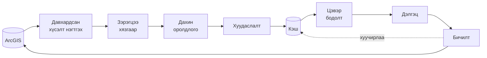
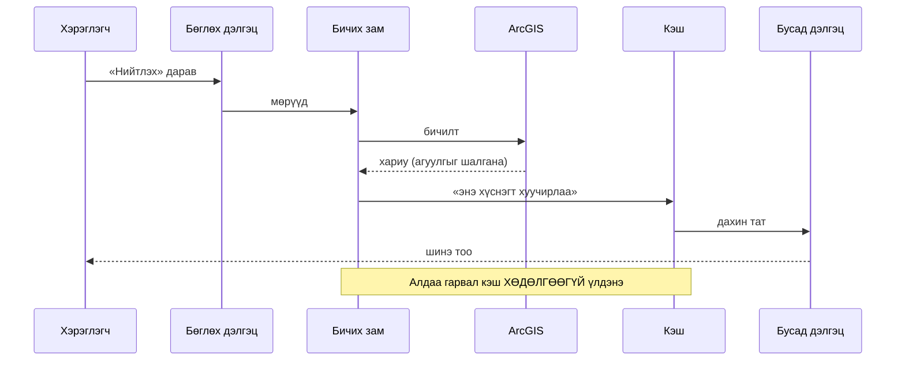

# 03 · Тоо дэлгэц дээр хэрхэн гарч ирдэг вэ

Энэ файл нь «энэ тоо хаанаас гарав?» гэсэн асуултын **механизмыг** тайлбарлана.
Эх сурвалж өөрөө [02](02-ogogdliin-esurvalj.md)-т.

---

## 1. Дөрвөн үе шат



Энэ бол баримтын **гол зураг**. Тоо бүр энэ замаар явна.

---

## 2. Асуулгын давхарга — юуг баталгаажуулдаг вэ

Порталын бүх уншилт нэг л замаар дамждаг
([`src/lib/query.ts`](../../src/lib/query.ts)).

### 2.1 Зэрэгцээ хүсэлтийн хязгаар

Систем нэгэн зэрэг **12** хүсэлт илгээж эхэлдэг. Хэрэв сервер «хэт олон
хүсэлт» гэж хариулвал хязгаар **6 болж буурч, буцаж өсөхгүй**.

⚠️ Яагаад буцаж өсгөдөггүй вэ: сервер нэг удаа гомдол хэлсэн бол дараагийн
хүнд ачаалал дээр дахин гомдоно. Тухайн сешнд аюулгүй түвшинд үлдэх нь
хэрэглэгчийн хувьд **бага зэрэг удаан** боловч **найдвартай**.

### 2.2 Дахин оролдлого

Хүсэлт унавал систем **4 удаа** дахин оролдоно, тус бүрийн хооронд хүлээх
хугацааг уртасгана. 30 секундэд хариу ирэхгүй бол цуцална.

### 2.3 Давхардсан хүсэлтийг нэгтгэх

Нэг дэлгэц дээр олон карт **ижил** асуулга явуулах нь түгээмэл. Систем
хоорондоо яг ижил хүсэлтийг нэг л удаа илгээж, хариуг бүгдэд тараана.

Хэмжсэн үр дүн: 41 ачаалагчийн **436 хүсэлтийн 44 нь яг ижил** байсан.

### 2.4 Хуудаслалт — 2,000-аас их мөрийг бүтнээр авах

ArcGIS нэг хүсэлтэд ойролцоогоор **2,000 мөр** буцаадаг. Түүнээс их бол
систем үлдсэнийг дараалан татна.

> ⚠️ Хэрэв эрэмбэ заагаагүй бол ArcGIS хуудас хооронд **тогтворгүй** дараалал
> буцааж, зарим мөр хоёр удаа, зарим нь огт ирэхгүй байж болно. Систем үүнийг
> илрүүлж, тогтвортой эрэмбээр эхнээс нь дахин татдаг.

### 2.5 ⚠️ ArcGIS алдааг «амжилттай» хариуны дотор буцаана

Энэ нь порталын хамгийн ноцтой занга. Систем хариу бүрийн **агуулгыг**
шалгадаг. Дэлгэрэнгүй: [06 §7](06-toonii-dursam.md).

---

## 3. Кэш ба хүчингүй болголт

### 3.1 Арван нэгэн хүснэгтийн түлхүүр

Кэш нь **ачаалагчаар биш, ХҮСНЭГТЭЭР** зохион байгуулагдсан:

```
HO_IPC · CASHFLOW_NEW · BAGTS_SHEET · BAGTS_NEGTGEL · BUILDING
PARCEL_LEFT · SOURCE_FS · HABEA · HYANALT · ZOVSHOOROL · SURVEY
```

Ачаалагч бүр «би энэ хүснэгтээс уншина» гэж зарлана; бичих тал «би энэ
хүснэгтийг өөрчиллөө» гэж хэлнэ. Систем холбоосыг өөрөө олно.

⚠️ **Яагаад ачаалагчаар биш вэ:** «энэ ачаалагчийг шинэчил» гэж гараар
бичвэл шинэ ачаалагч нэмэгдэх бүрд тэр жагсаалт хоцорно. Хүснэгтээр
холбоход зураглал өөрөө тэнцвэрээ хадгална.

### 3.2 Бөглөснөөс дэлгэц хүртэл



⚠️ Хүчингүй болголт нь бичилт **амжилттай болсны дараа л** ажиллана.
Амжилтгүй бичилтийн дараа кэш хаявал сайн өгөгдлийг дэмий дахин татна.

### 3.3 Алдааг кэшлэхгүй

Хүсэлт унавал систем тэр үр дүнг **хадгалахгүй** — дараагийн оролдлого
шинээр явна. Эс бөгөөс нэг удаагийн сүлжээний тасалдал сешн дуустал
«өгөгдөл байхгүй» болж үлдэнэ.

### 3.4 Кэш асуулгын давхаргад БАЙХГҮЙ

Давхардсан хүсэлтийг нэгтгэх (§2.3) нь **кэш биш** — хариу ирмэгц
устдаг. Тиймээс хуучирсан өгөгдөл хэзээ ч буцаахгүй.

---

## 4. Бодолтын давхарга

### 4.1 Яагаад тусгаарлагдсан вэ

Бүх тооцоо нь **сүлжээнд хандахгүй, цэвэр** функцээр бичигдсэн. Ингэснээр
тэдгээрийг амьд үйлчилгээгүйгээр, тогтмол өгөгдлөөр шалгах боломжтой.

Төсөлд ийм шалгуур **84** байна — тоон логикийн алдааг нийтлэхээс өмнө барина.

### 4.2 Юу тооцдог вэ

| Бодолт | Юуг гаргадаг |
|---|---|
| Ерөнхий дашбоардын тооцоо | Санхүү · газар · төлөвлөгөө · ХАБЭА-г нэг хугацааны шүүлтээр нэгтгэнэ |
| Хуваарийн загвар | Ажлын үргэлжлэх хугацаа, хоцрогдол, хуваарийн хамралт |
| Санхүүжилтийн тооцоо | Гэрээгээр бүлэглэх, багцад хуваарилах, дугаарын цоорхой олох |
| Төлбөр-багцын холбоос | Аль төлбөр аль багцад хамаарахыг обьёмын агшнаар тогтооно |
| Нэгтгэлийн тооцоо | Багцын жинлэсэн гүйцэтгэлийг төслийн түвшинд хүргэх |
| Төлөвлөгөөт муруй | Гэрээний сарын дүнгээс хуримтлал өөрөө бодно ([06 §4](06-toonii-dursam.md)) |
| Блокийн явц | Бөглөх хуудсаас барилгын блок тус бүрийн түүх |
| Үерийн загвар | Гадаргуугийн өндрөөс усны хөдөлгөөн |
| Удирдлагын үзүүлэлт | 13 KPI (доор) |

### 4.3 Удирдлагын 13 үзүүлэлт

Дараалал нь **төслийн мөчлөгөөр**: судалгаа → зөвшөөрөл → газар → хуваарь →
гүйцэтгэл → чанар → ашиглалт → хүн → аюулгүй байдал → хяналт → санхүү.

| # | Үзүүлэлт | Юу хэмждэг | Эх сурвалж | Очих дэлгэц |
|---|---|---|---|---|
| 1 | Тохиромжтой байдал | Бүсийн хөгжлийн боломжийн үнэлгээ | Орон зайн шинжилгээ | Анализ |
| 2 | Зөвшөөрөл | Хүлээгдэж буй хүсэлт | `ZOVSHOOROL` | Зөвшөөрөл |
| 3 | Газар чөлөөлөлт | Чөлөөлөгдөөгүй үлдсэн талбар | `PARCEL_LEFT` | Газар |
| 4 | Хуваарийн хоцрогдол | Төлөвлөгөө ↔ бодит хугацаа | `BAGTS_SHEET` · `CASHFLOW_NEW` · `HO_IPC` | Багцын гүйцэтгэл |
| 5 | Обьёмын зөрүү | Төлөвлөсөн ↔ гүйцэтгэсэн обьём | `BAGTS_SHEET` | Гүйцэтгэл |
| 6 | Чанарын хяналт | Шийдвэрлээгүй чанарын асуудал | `BAGTS_SHEET` · `QAQC` | Чанар |
| 7 | Мэдрэгчийн босго | Хэмжилт хэвийн хязгаараас гарсан эсэх | `IOT` | IoT |
| 8 | Хүн · техник | Өмнөх өдрөөс хэлбэлзэл | `HABEA` | ХАБЭА |
| 9 | ХАБЭА | Осол, зөрчлийн тоо | `HABEA` | ХАБЭА |
| 10 | Хяналтын хоцролт | Бөглөснөөс шийдвэрлэх хүртэлх хугацаа | `HYANALT` · `BAGTS_SHEET` | Гүйцэтгэл |
| 11 | Гэрээ ба төсвийн зөрүү | Төсөвлөсөн ↔ гэрээлсэн | `CASHFLOW_NEW` | Санхүү |
| 12 | Гэрээгүй ажил | Төсөвлөсөн ч гүйцэтгэгч шалгараагүй | `CASHFLOW_NEW` | Санхүү |
| 13 | Олгосон санхүүжилт | Бодитоор шилжсэн мөнгө | `HO_IPC` | Санхүү |

⚠️ №13 нь **«акт» БИШ**. Эх сурвалж нь бүртгэгдсэн төлбөр бөгөөд актын
төлөв, хамрах хугацаа, суутгал агуулдаггүй.

⚠️ Хүнд тооцоолол шаардсан үзүүлэлтүүд (1 · 3 · 5 · 6) хөнгөнийхөө дараа
шатлан ачаалагдана — бүгд зэрэг явбал сервер «хэт олон хүсэлт» гэж хариулна.

---

## 5. Тоо ХЭЗЭЭ шинэчлэгддэг вэ

**Асуулт:** «Би одоо бөглөлөө. Дашбоард дээр хэзээ гарах вэ?»

**Хариу:** бичилт амжилттай болмогц, тэр хүснэгтээс уншдаг **бүх дэлгэц
шууд** шинэчлэгдэнэ. Хуудсыг дахин ачаалах шаардлагагүй.

> ⚠️ **Гэхдээ зөвхөн ТАНЫ дэлгэц дээр.** Өөр хэрэглэгчийн нээлттэй байгаа
> хуудас өөрөө шинэчлэгдэхгүй — тэр хүн хуудсаа дахин ачаалах эсвэл өөр
> харагдац руу орж буцах хэрэгтэй.
>
> Хурал дээр хоёр хүн ижил дэлгэц хараад өөр тоо харах шалтгаан ихэвчлэн энэ.
> Дэлгэрэнгүй: [08 §4](08-hyzgaarlalt.md).

Зарим ачаалагч **5 минутын** шинэчлэлтийн хугацаатай — өөр хүний оруулсан
өгөгдөл тэр хугацаанд өөрөө орж ирнэ.

---

**Дараагийн алхам:** харагдац бүр юу харуулдгийг
[04 · 19 харагдац](04-haragdac.md)-аас үзнэ үү.

---

**Хамгийн сүүлд шинэчилсэн:** 2026-09-16
**Автомат шалгуур:** [`docs/docs.invariant.check.mjs`](../docs.invariant.check.mjs) (Ш2, Ш4, Ш5)
**Гараар шалгах:** зэрэгцээ хязгаарын тоо (12 · 6), дахин оролдлогын тоо (4)
