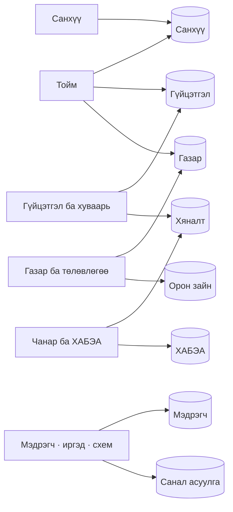

# 04 · Харагдацууд

Портал **22 харагдацтай**. Энэ файл нь тус бүр нь юунд хариулдаг, тоо нь
хаанаас гардгийг тайлбарлана.

---

## 0. Харагдац ↔ эх сурвалжийн холбоо

⚠️ Харагдацуудыг 11 эх сурвалжтай бүрэн холбовол зураг уншигдахгүй болно.
Тиймээс харагдацуудыг **сэдвээр бүлэглэв**.

| Бүлэг | Харагдацууд |
|---|---|
| Тойм | Ерөнхий дашбоард · Төслийн дэлгэрэнгүй · Тайлан · Үйл ажиллагааны схем |
| Санхүү | Багцын санхүү · Санхүүжилт |
| Гүйцэтгэл ба хуваарь | Багцын гүйцэтгэл · Гүйцэтгэл · Хуваарь |
| Газар ба төлөвлөгөө | Газар чөлөөлөлт · Ерөнхий төлөвлөгөө · Инженерийн дэд бүтэц · Зөвшөөрөл · Тохиромжтой байдал |
| Чанар ба ХАБЭА | Чанар · ХАБЭА |
| Бусад | IoT хяналт · Эрсдэлийн загвар · Иргэдэд хүрэх үр өгөөж |

---

## 1. Бүгд нэг хүснэгтэд

⚠️ **«Бөглөдөг үү» багана чухал.** Тоо нь хүний гараар оруулсан уу, эсвэл
системийн тооцоолсон уу — хоёрын итгэх түвшин өөр.

| Харагдац | Юунд хариулдаг вэ | Гол эх сурвалж | Тоо яаж гардаг вэ | Бөглөдөг үү |
|---|---|---|---|---|
| **Ерөнхий дашбоард** | Төсөл ямар байдалтай вэ? | `HO_IPC` · `PARCEL_LEFT` · `BAGTS_NEGTGEL` · `HABEA` | 4 салбарын үзүүлэлтийг нэг хугацааны шүүлтээр нэгтгэнэ | Үгүй |
| **Төслийн дэлгэрэнгүй мэдээлэл** | Дэлгэрэнгүй судлах | олон эх сурвалж | 9 дэд хэсэгт задарна | Үгүй |
| **Ерөнхий төлөвлөгөө** | Юу хаана баригдах вэ? | `ET` · `ET_PKG` | Давхарга бүрийн тоо, урт, талбайг шууд тоолно | Үгүй |
| **Багцын санхүү** | Аль багц хэдий мөнгө авав? | `HO_IPC` + `CASHFLOW_NEW` | Багцаар нийлүүлж, төлөвлөгөөтэй харьцуулна | Үгүй |
| **Багцын гүйцэтгэл** | Аль багц хэдэн хувьтай вэ? | `BAGTS_SHEET` · `BAGTS_NEGTGEL` | Бөглөх хуудасны жинлэсэн хувийг ШУУД авна | Шууд бус |
| **Газар чөлөөлөлт** | Газар хэр чөлөөлөгдсөн бэ? | `PARCEL_LEFT` · `BUILDING` | Үлдсэн талбарын тоо, талбайг төлөвөөр бүлэглэнэ | **Тийм** |
| **Тохиромжтой байдлын үнэлгээ** | Хаана юу барих нь зөв бэ? | орон зайн давхаргууд | БНБД норм + эдийн засгийн оноо | Үгүй |
| **Иргэдэд хүрэх үр өгөөж** | Иргэдэд юу нэмэгдэв? | `IRGED_BUILT` · `IRGED_TOILET` · нийгмийн давхаргууд | Өмнө ↔ дараа харьцуулалт | Үгүй |
| **Хуваарь** | Ажил хэзээ эхэлж дуусах вэ? | `BAGTS_SHEET` · `HUVAARI_OBYEM` | Блокийн хэмнэлээс хугацаа бодно | **Тийм** |
| **Хуваарь батлах** | Ямар хуваарийн санал хүлээгдэж байна? | хуваарийн батлах хүснэгт | Бүх багцын ирсэн саналыг НЭГ дараалалд · зохиогч өөрийгөө батлахгүй | **Тийм** |
| **Тайлан** | Тайлан бэлтгэх | бүх гол эх сурвалж | Бэлэн загварт тоог байрлуулна | Үгүй |
| **Санхүүжилт** | Гэрээ хэрхэн санхүүжиж байна? | `CASHFLOW_NEW` · `HO_IPC` | Гэрээгээр бүлэглэж, сараар задална | **Тийм** |
| **ХАБЭА** | Аюулгүй байдал ямар вэ? | `HABEA` (3 маягт) | Осол, хүн-техникийг өдрөөр тоолно | Survey123-аар |
| **IoT хяналт** | Мэдрэгч юу хэлж байна? | `IOT` (5 үйлчилгээ) | Хугацааны цуваа + сүүлийн заалт | Үгүй |
| **Эрсдэлийн загвар** | Үер, бохирдлын эрсдэл? | гадаргуугийн өгөгдөл | Загварчлалын тооцоо | Үгүй |
| **Инженерийн дэд бүтэц** | Шугам сүлжээ хэр баригдав? | `INFRA_SVC` · `ET_PKG` | Давхаргын тоо, урт нийлбэр | **Тийм** |
| **Зөвшөөрөл** | Ямар зөвшөөрөл хүлээгдэж байна? | `ZOVSHOOROL` | Төлөвөөр бүлэглэн тоолно | **Тийм** |
| **Гүйцэтгэл** | Бөглөх · илгээх · батлах | `BAGTS_SHEET` · `HYANALT` | 4 шатат урсгалын төлөв | **Тийм** |
| **Чанар (QAQC)** | Чанарын баримт бүрдсэн үү? | `QAQC` · `QAQC2` | Баримтын төрлөөр тоолно | **Тийм** |
| **Чанарын баримт** | Аргачлал, материал батлагдсан уу? | чанарын баримтын хүснэгт | Төлөв ба шатаар тоолно | **Тийм** |
| **Үйл ажиллагааны схем** | Төсөл ямар шатанд явна вэ? | 8 эх сурвалж | Байгаа тоог схемийн картад байрлуулна | Үгүй |
| **Системийн баримт** | Портал өөрөө яаж ажилладаг вэ? | — (энэ баримт) | Тоо байхгүй — зөвхөн тайлбар | Үгүй |

⚠️ «Шууд бус» гэдэг нь: тэр дэлгэцээс өөрөөс нь бөглөхгүй ч, харуулж буй тоо нь
хүний бөглөсөн өгөгдлөөс гардаг гэсэн үг.

---

## 2. Зургаан гол харагдац дэлгэрэнгүй

### 2.1 Ерөнхий дашбоард {#gdash}

**Ямар асуултад хариулдаг вэ.** Төсөл бүхэлдээ ямар байдалтай байна вэ?
Нэг дэлгэцээс санхүү, газар, төлөвлөгөө, аюулгүй байдлын байдлыг харна.
Портал нээхэд эхэлж гарч ирдэг.

**Дэлгэц дээр юу харагддаг вэ.** Дээд талд гол үзүүлэлтүүд, доор нь
санхүүгийн муруй, газар чөлөөлөлтийн явц, багцын гүйцэтгэлийн жагсаалт,
ХАБЭА-гийн товч.

**Тоо хаанаас гардаг вэ**

| Үзүүлэлт | Эх сурвалж | Тооцох арга |
|---|---|---|
| Төслийн төсөв | `CASHFLOW_NEW` | Гэрээний ажлын мөрүүдийн нийлбэр |
| Олгосон санхүүжилт | `HO_IPC` | Бүх төлбөрийн бичилтийн нийлбэр |
| Газар чөлөөлөлт | `PARCEL_LEFT` | Үлдсэн талбарын **багасалт** |
| Гүйцэтгэлийн хувь | `BAGTS_NEGTGEL` | Багцын жинлэсэн дундаж |
| ХАБЭА | `HABEA` | Ослын тоо, хүн-техникийн өдрийн задаргаа |

⚠️ **Анхаарах зүйл**
- Хугацааны шүүлт **бүх картад нэгэн зэрэг** үйлчилнэ — нэг картын тоо
  өөрчлөгдвөл бусад нь ч өөрчлөгдсөн байна.
- Гүйцэтгэлийн хувь нь **батлагдсан** нэгтгэлээс гардаг. Өнөөдөр бөглөсөн ч
  батлагдаагүй өгөгдөл энд харагдахгүй — [05 §6](05-erh-batlah.md).
- Хэмжигдээгүй ажил тооцоонд **ОРОХГҮЙ** — [06 §2](06-toonii-dursam.md).

**Хэн засаж чадах вэ.** Энэ дэлгэцээс юу ч засахгүй — зөвхөн харах.

**Холбоотой:** [02 §3](02-ogogdliin-esurvalj.md) · [06 §2](06-toonii-dursam.md)

---

### 2.2 Багцын санхүү {#pkgfin}

**Ямар асуултад хариулдаг вэ.** Аль багц хэдий мөнгө төлөвлөсөн, хэдийг
бодитоор авсан бэ? Хоёрын зөрүү хэр вэ?

**Дэлгэц дээр юу харагддаг вэ.** Багцын жагсаалт, тус бүрд гэрээт дүн,
олгосон дүн, хувь. Багц дарахад төлбөрийн бичилтүүд задарна.

**Тоо хаанаас гардаг вэ**

| Үзүүлэлт | Эх сурвалж | Тооцох арга |
|---|---|---|
| Олгосон санхүүжилт | `HO_IPC` | Багцын бүх төлбөрийн нийлбэр |
| Гэрээт дүн | `CASHFLOW_NEW` | Багцын гэрээнүүдийн төсөв |
| Гүйцэтгэлийн хувь | дээрх хоёр | олгосон ÷ гэрээт × 100 |
| Хэмнэлт | `CASHFLOW_NEW` | **Тусгай талбараас, ТООЦООЛДОГГҮЙ** |
| Урьдчилгаа / гүйцэтгэл | `HO_IPC` | Төлбөрийн төрлөөр салгана |

⚠️ **Анхаарах зүйл**
- «Хэмнэлт» нь эх сурвалжаас **шууд ирдэг**, портал бодохгүй. Эргэлзвэл
  анхдагч бүртгэлээс шалгана.
- Гэрээний талбар төлбөрийн мөр бүрд **давтагдана** — Excel-ээр нийлбэр
  авбал төсөв хэд дахин гарна ([02 §3.1](02-ogogdliin-esurvalj.md)).
- Зарим төлбөр багцад **холбогдоогүй** байж болно; систем эдгээрийг тусад нь
  харуулдаг.

**Хэн засаж чадах вэ.** Харах зориулалттай. Төлбөр-багцын холбоосыг систем
өөрөө нөхдөг.

**Холбоотой:** [02 §3](02-ogogdliin-esurvalj.md) · [06 §6](06-toonii-dursam.md)

---

### 2.3 Багцын гүйцэтгэл {#pkgprog}

**Ямар асуултад хариулдаг вэ.** Аль багц хэдэн хувийн биет гүйцэтгэлтэй вэ?
Блок тус бүр ямар шатанд явна вэ?

**Дэлгэц дээр юу харагддаг вэ.** Багцын жагсаалт хувьтайгаа, блокийн
төлөвийн хүснэгт, барилгын хяналтын төлөв.

**Тоо хаанаас гардаг вэ**

| Үзүүлэлт | Эх сурвалж | Тооцох арга |
|---|---|---|
| Багцын гүйцэтгэл | `BAGTS_SHEET` | Бөглөх хуудасны жинлэсэн мөрийг **ШУУД** авна |
| Батлагдсан гүйцэтгэл | `BAGTS_NEGTGEL` | Дөрвөн шат өнгөрсөн утга |
| Блокийн явц | `BAGTS_SHEET` | Блок бүрийн бөглөсөн мөрүүдийн түүх |
| Хяналтын төлөв | `HYANALT` | Аль шатанд хүлээгдэж байгаа |

> ⚠️ **Портал гүйцэтгэлийн хувийг ДАХИН БОДОХГҮЙ.** Бөглөх хуудсанд
> жинлэсэн хувь аль хэдийн тооцоологдсон байдаг. Портал түүнийг шууд харуулна.
> Тиймээс хувь буруу харагдвал **бөглөх хуудсаа** шалгана, порталыг биш.

⚠️ **Анхаарах зүйл**
- Бөглөгдөөгүй блок **цоорхой** үлдэнэ, 0% биш ([06 §2](06-toonii-dursam.md)).
- «Багцын дундаж» нь бөглөгдсөн блокуудын дундаж — хэдэн блок бөглөгдсөнийг
  хамт харна.

**Хэн засаж чадах вэ.** Энэ дэлгэцээс биш; бөглөлт нь «Гүйцэтгэл» дэлгэцээр.

**Холбоотой:** [06 §1–2](06-toonii-dursam.md) · [05 §5](05-erh-batlah.md)

---

### 2.4 Санхүүжилт {#finance}

**Ямар асуултад хариулдаг вэ.** Гэрээ хэрхэн санхүүжиж байна вэ? Сар бүр
хэдий мөнгө төлөгдөх төлөвлөгөөтэй вэ?

**Дэлгэц дээр юу харагддаг вэ.** Гэрээний хүснэгт (задардаг), төлөвлөгөөт ба
бодит муруй, сарын хуваарилалтын хүснэгт.

**Тоо хаанаас гардаг вэ**

| Үзүүлэлт | Эх сурвалж | Тооцох арга |
|---|---|---|
| Гэрээний төсөв | `CASHFLOW_NEW` | Ажлын мөрөөс шууд |
| Сарын хуваарилалт | `CASHFLOW_NEW` | Сарын мөрүүдээс |
| Төлөвлөгөөт муруй | `CASHFLOW_NEW` | Сарын дүнгээс хуримтлал **өөрөө бодно** |
| Бодит олголт | `HO_IPC` | Төлбөрийн бичилтийг сараар бүлэглэнэ |

> ⚠️ **Хуримтлагдсан хувь жил бүр тэглэгддэг.** Тиймээс систем эх сурвалжийн
> хуримтлалыг **ашиглахгүй**, гэрээний сарын дүнгээс өөрөө бодно. Эс бөгөөс
> төлөвлөгөөт муруй жил бүрийн 1-р сард 0 руу унана
> ([06 §4](06-toonii-dursam.md)).

⚠️ **Анхаарах зүйл**
- Зарим гэрээнд хугацааны талбар **хоосон** — эх файлд байгаагүй. 0 гэж
  ойлгож болохгүй.
- Excel загварын хүснэгт нь эх файлын бүтцийг давтдаг тул бүх мөрийг
  нийлүүлбэл эх файлд **байхгүй** тоо гарна.

**Хэн засаж чадах вэ.** Мөнгөн урсгалын төлөвлөгөөг тусгай эрхтэй хэрэглэгч
засна ([05 §2](05-erh-batlah.md)).

**Холбоотой:** [02 §3.2](02-ogogdliin-esurvalj.md) · [06 §4](06-toonii-dursam.md)

---

### 2.5 Гүйцэтгэл {#guitsetgel}

**Ямар асуултад хариулдаг вэ.** Бөглөсөн гүйцэтгэл ямар шатанд явна вэ?
Хэн дээр хүлээгдэж байна вэ?

**Дэлгэц дээр юу харагддаг вэ.** Бөглөх хуудас, илгээх товч, хяналтын
шатуудын төлөв, буцаасан тайлбар.

**Тоо хаанаас гардаг вэ**

| Үзүүлэлт | Эх сурвалж | Тооцох арга |
|---|---|---|
| Бөглөсөн обьём | `BAGTS_SHEET` | Хэрэглэгчийн оруулсан утга |
| Хяналтын шат | `HYANALT` | Хамгийн сүүлийн шийдвэрээс |
| Хоцролт | `HYANALT` | Илгээснээс шийдвэрлэх хүртэлх өдөр |

**Дөрвөн шат:** компани → инженер → менежер → захирал.
Дэлгэрэнгүй: [05 §5](05-erh-batlah.md).

⚠️ **Анхаарах зүйл**
- Нэг удаад **мянга мянган мөр** нийтлэгдэж болно. Тасалдвал хагас орох
  эрсдэлтэй — [05 §7](05-erh-batlah.md), [08 §2](08-hyzgaarlalt.md).
- Батлагдаагүй гүйцэтгэл дашбоардын нэгтгэлд **ОРОХГҮЙ**.

**Хэн засаж чадах вэ.** Багцад томилогдсон хэрэглэгч бөглөнө; шат бүрд
тусдаа эрх ([05 §5](05-erh-batlah.md)).

**Холбоотой:** [05](05-erh-batlah.md) · [06 §2](06-toonii-dursam.md)

---

### 2.6 Үйл ажиллагааны схем {#schem}

> ⚠️ **ЭНЭ БАРИМТТАЙ АНДУУРЧ БОЛОХГҮЙ.**
>
> Порталын «Үйл ажиллагааны схем» нь **барилгын төслийн** ажлын урсгалыг
> зурдаг: Төлөвлөлт → Зөвшөөрөл / Газар → Хуваарь → Барилга → Хяналт →
> Санхүү → Тайлан.
>
> Харин та одоо уншиж буй баримт нь **програм хэрхэн ажилладгийг**
> тайлбарлана. Хоёр өөр зүйл.

**Ямар асуултад хариулдаг вэ.** Төсөл ямар шатанд явна вэ? Аль үе шатанд
хэдэн ажил хүлээгдэж байна вэ?

**Дэлгэц дээр юу харагддаг вэ.** Хоорондоо сумаар холбогдсон карт бүхий
схем. Хоёр нарийвчлал: **ерөнхий** (10 карт) ба **дэлгэрэнгүй** (24 карт).
Карт дарахад дэлгэрэнгүй самбар нээгдэнэ.

**Тоо хаанаас гардаг вэ.** Энэ харагдац **шинэ асуулга явуулдаггүй** — бусад
дэлгэц аль хэдийн татсан тоог дахин ашиглана. Тиймээс дашбоардаас схем рүү
орход нэмэлт хүлээлт гарахгүй.

Найман эх сурвалж: `CASHFLOW_NEW` · `PARCEL_LEFT` · `BAGTS_SHEET` ·
`BAGTS_NEGTGEL` · `HABEA` · `HO_IPC` · `HYANALT` · `ZOVSHOOROL`.

⚠️ **Анхаарах зүйл**
- Сумны гурван төрөл: **үе шатны хамаарал** · **тэжээх холбоо** (дараалал биш) ·
  **буцаалт**. Бүгдийг нэг сумаар зурвал худал ойлголт төрнө.
- Аль нэг эх сурвалж унавал схем түүнийг **нэрлэж** харуулна — «өгөгдөл алга»
  гэж чимээгүй хоосон болохгүй.

**Хэн засаж чадах вэ.** Харах зориулалттай.

**Холбоотой:** [03 §3](03-ogogdliin-zam.md)

---

## 3. Үлдсэн харагдацууд

### Төслийн дэлгэрэнгүй мэдээлэл
Газрын зургийг тойрсон нэгдсэн үзүүлэлт, 9 дэд хэсэгт задардаг судлах хэрэгсэл.
⚠️ «Ерөнхий дашбоард»-тай **хоёулаа** байдаг: энэ нь задардаг, тэр нь задрахгүй
тойм ([08 §5](08-hyzgaarlalt.md)).

### Ерөнхий төлөвлөгөө
Бүс, барилга, инженерийн шугам, зам, ногоон орчны байршил.
Тоо нь давхаргын шууд тоолол — тооцоолол байхгүй.

### Газар чөлөөлөлт
Полигон дотор шүүсэн чөлөөлөлтийн явц. Явцыг **үлдсэн** талбарын багасалтаар
хэмжинэ. ⚠️ Талбарын төлөв өөрчлөх эрх тусад нь олгогдоно.

### Тохиромжтой байдлын үнэлгээ
БНБД норм ба эдийн засгийн үр ашгаар бүс бүрийг үнэлнэ.
⚠️ Энэ нь **загварчлал**, бүртгэл биш — оноо нь таамаглал.

### Иргэдэд хүрэх үр өгөөж
Нийгмийн дэд бүтцийн өмнө ↔ дараа харьцуулалт.
⚠️ Санал асуулгын хариу ирээгүй хэсэг **хоосон** үлдэнэ — «сөрөг» гэж ойлгож
болохгүй.

### Хуваарь
Ажлын эхлэх, дуусах хугацааг блокийн хэмнэлээр төлөвлөнө.
⚠️ Хуваарь бол **хэмжилт биш төлөвлөгөө** — архивт шинэ агшин үүсгэхгүй,
байгаа хуудсанд буцаж бичигдэнэ. Засах эрх тусад нь.

### Тайлан
Бэлэн загварт тоог байрлуулж, PDF болон имэйлээр гаргана.
Бүх тоо бусад харагдацынхтай **ижил** эх сурвалжаас.

### ХАБЭА
Ажилтан, техник, осол зөрчил, цамхагт кран.
⚠️ Бөглөлт нь **гар утасны Survey123 маягтаар**, порталаас биш.
⚠️ Үзлэгийн зураг нэвтрэлт шаардана.

### IoT хяналт
Таван төрлийн мэдрэгчийн амьд заалт ба хугацааны цуваа.
⚠️ Газрын зураг дээр зөвхөн **суурилуулалтын цэг** харагдана
([02 §8](02-ogogdliin-esurvalj.md)).

### Эрсдэлийн загвар
Голын ус (үер), агаарын бохирдлын одоогийн байдал ба таамаглал.
⚠️ **Загварчлал** — хэмжилт биш.

### Инженерийн дэд бүтэц
Дулаан, ус, ариутгах татуурга, цахилгааны шугам сүлжээ.
⚠️ **Бүсийн шүүлт энд ажиллахгүй** ([02 §2.3](02-ogogdliin-esurvalj.md)).

### Зөвшөөрөл
Багц бүрийн зөвшөөрлийн шат дараалал, төлөв.
⚠️ Хүлээгдэж буй хүсэлт нь удирдлагын үзүүлэлтийн нэг.

### Чанар (QAQC)
М-акт, FIC, MA, MIR — шалгалтын төлөвлөгөөний баримт бичиг.
⚠️ Багц бүрд **тусдаа хүснэгт**; эрх нь багцаар олгогдоно.

---

**Дараагийн алхам:** хэн юуг засах эрхтэйг [05 · Эрх ба батлах](05-erh-batlah.md)-аас.

---

**Хамгийн сүүлд шинэчилсэн:** 2026-09-16
**Автомат шалгуур:** [`docs/docs.invariant.check.mjs`](../docs.invariant.check.mjs) (Ш1 — 19 харагдац хоёр талдаа тулгагдана)
**Гараар шалгах:** «Тоо яаж гардаг вэ» баганын тайлбар — тооцоолол өөрчлөгдвөл энд шинэчилнэ
