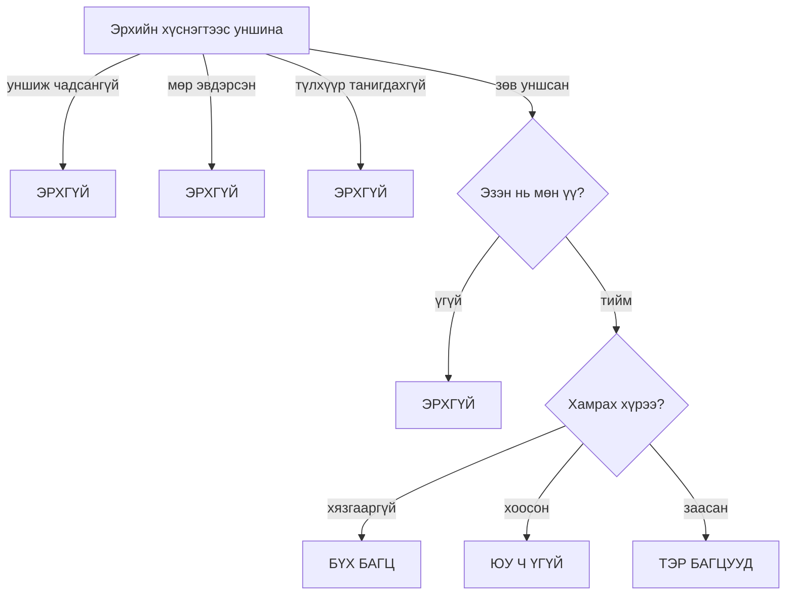
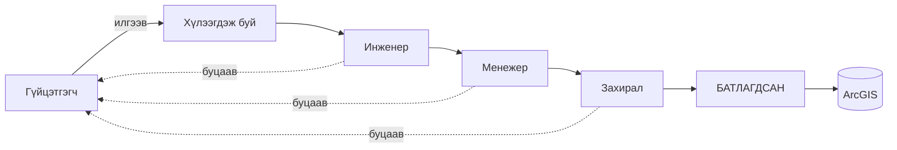

# 05 · Эрх, батлах урсгал, бичилт

Хэн юуг харах, хэн юуг засах вэ? Өгөгдөл ArcGIS руу хэрхэн буцаж бичигддэг вэ?

---

## 1. Эрх ГАНЦ хүснэгтэд

Порталын бүх эрх **нэг ArcGIS хүснэгтэд** хадгалагдана. Шинэ төрлийн эрх
нэмэхэд шинэ багана, шинэ хүснэгт үүсгэдэггүй — мөрийн угтвараар ялгана.

| Угтвар | Юуг заана |
|---|---|
| `__flow__:` | Гүйцэтгэлийн урсгалын шатны томилгоо |
| `__cap__:` | Нэмэлт эрх (мөр нэмэх, чанар, зөвшөөрөл, санхүү засах …) |
| `__qaqc__:` | Чанарын багцын хуваарилалт |
| `__huvaari__:` | Хуваарийн багцын хуваарилалт |
| `__obyem__:` | Обьёмын багцын хуваарилалт |

⚠️ **Хүснэгтийн эзнийг шалгадаг.** Ижил нэртэй хүснэгт өөр хүн үүсгэж
болно. Систем зөвхөн зөвшөөрөгдсөн эзний хүснэгтийг хүлээж авна — эс бөгөөс
хэн ч ижил нэртэй хүснэгт үүсгээд өөртөө эрх бичиж чадна.

---

## 2. Эрхгүй гэж үзэх гурван тохиолдол — «хаалттай бол татгалзах»



Систем эргэлзсэн тохиолдолд **үргэлж татгалзана**. Сүлжээ унасан,
тохиргоо эвдэрсэн, эсвэл танихгүй утга тааралдсан — бүгд «эрхгүй».

⚠️ **Яагаад ийм хатуу вэ:** эсрэгээр нь хийвэл сүлжээний түр тасалдал
бүгдэд бүх эрх нээнэ. Хатуу байдал нь заримдаа эвгүй боловч аюулгүй.

---

## 3. Хамрах хүрээ — гурван утга

| Тохиргоо | Утга |
|---|---|
| **Хязгааргүй** | Бүх багц |
| **Хоосон** | ⚠️ **ЮУ Ч БИШ** — «бүгд» ГЭСЭН ҮГ БИШ |
| **Заасан жагсаалт** | Зөвхөн тэр багцууд |

> ⚠️ Хамгийн түгээмэл буруу ойлголт нь **хоосон** тохиргоо. Хэрэглэгчид эрх
> олгоод багц сонгохоо мартвал тэр хүн **юу ч харахгүй**. «Эрх өгсөн атал
> ажиллахгүй байна» гэсэн гомдлын ихэнх шалтгаан энэ.

---

## 4. Гурван хяналт НЭГ кодоос

Хуваарь · Обьём · Чанар гурав нь **яг ижил бүтэцтэй** — ялгаа нь зөвхөн нэр.
Тиймээс тэдгээр нь нэг кодоос ажилладаг.

⚠️ **Яагаад чухал вэ:** урьд нь гурвуулаа тусдаа хуулбар байсан. Шалгалтаар
олдсон 13 алдааны **7 нь** нэг л хэв шинжтэй байв — засвар нь хуулбаруудын
**нэгд нь л** хүрч, бусад руу хуулагдаагүй. Одоо нэг газар зассан нь
гурвуулаад хүчинтэй.

⚠️ Гүйцэтгэлийн урсгал (§5) нь **энд ОРОХГҮЙ** — тэр нь шаттай бөгөөд
«нэг хүн нэг шатанд» гэсэн үндсэн өөр дүрэмтэй.

---

## 5. Гүйцэтгэлийн дөрвөн шатат урсгал



Шат бүр **зөвшөөрөх** эсвэл **буцаах** шийдвэр гаргана. Буцаасан бол
гүйцэтгэгч рүү шалтгаантайгаа хамт эргэнэ.

⚠️ **Нэг аккаунт нэг шатанд.** Нэг хүн хоёр шатанд томилогдвол өөрийнхөө
шийдвэрийг өөрөө баталгаажуулах болно — систем үүнийг зөвшөөрөхгүй.

⚠️ **Шатны цорын ганц эх сурвалж нь ТОМИЛГОО.** Хэрэглэгчийн шат нь
түүний үүрэг биш, тухайн багцад томилогдсон эсэхээс тодорхойлогдоно.

---

## 6. Батлах хоёр шат — Хуваарь ба Обьём

Хуваарь, обьёмын өөрчлөлт нь шууд хүчин төгөлдөр болохгүй:

```
Зохиогч → илгээнэ → «хүлээгдэж буй» мөр үүснэ
Батлагч → шийднэ  → зөвшөөрвөл хүчин төгөлдөр
```

> ⚠️ **Зохиогч өөрийнхөө ажлыг батлаж ЧАДАХГҮЙ.** Систем илгээгч ба батлагч
> нэг хүн эсэхийг **хоёр удаа** шалгана: илгээхийн өмнө, мөн бичихийн өмнө
> сервер дээрх бодит утгаар. Тиймээс нэг хүнд «засах» ба «батлах» эрхийг
> хамт өгвөл тэр хүн юу ч батлаж чадахгүй болно.

Хүлээгдэж буй мөр нь өөрчлөлтийн бүрэн агуулгыг хадгална — батлагч
юу өөрчлөгдөхийг **бүтнээр** харж байж шийднэ.

---

## 7. Бичилт — өгөгдөл ArcGIS руу буцах

Порталаас ArcGIS руу бичдэг **18** зам бий. Тус бүр нь бичилт амжилттай
болсныг баталгаажуулж, дараа нь холбогдох дэлгэцүүдэд «шинэчил» гэж
мэдэгдэнэ ([03 §3.2](03-ogogdliin-zam.md)).

### 7.1 ⚠️ Хагас нийтлэлийн эрсдэл

Бөглөх хуудас нийтлэхэд мөрүүд **500-гийн багцаар** илгээгдэнэ.

> **Буцаах хамгаалалт нь зөвхөн НЭГ багцын дотор ажиллана.**
>
> 3,000 мөр нийтлэхэд 4 дэх багц дээр сүлжээ тасарвал:
> - Систем «амжилтгүй» гэж хэлнэ
> - Гэвч эхний **1,500 мөр ArcGIS-д аль хэдийн бичигдсэн** байна
>
> Энэ тохиолдолд өгөгдлийг **гараар шалгах** шаардлагатай. Систем үүнийг
> нуухгүй — нийтлэлийн үр дүнд хэдэн мөр бичигдсэнийг ил харуулна.

⚠️ Энэ бол ArcGIS-ийн үйлчилгээний хязгаарлалт, порталын алдаа биш.
Хамгийн найдвартай арга: **бага багаар, олон удаа** нийтлэх.

### 7.2 Бичилт амжилтгүй болбол

Кэш **хөдөлгөөнгүй** үлдэнэ — дэлгэц дээрх тоо хуучин хэвээр. Энэ нь
санаатай: амжилтгүй бичилтийн дараа дахин татах нь сайн өгөгдлийг
дэмий солино.

---

## 8. Хэн юуг бичиж чадах вэ

| Юу | Хаанаас | Ямар эрх шаардлагатай |
|---|---|---|
| Гүйцэтгэл бөглөх | Гүйцэтгэл | Багцад томилогдсон байх |
| Гүйцэтгэл батлах | Гүйцэтгэл | Шатны томилгоо (инженер / менежер / захирал) |
| Хуваарь засах | Хуваарь | Хуваарийн эрх + багц |
| Хуваарь батлах | Хуваарь | Батлах эрх (засах эрхээс **тусдаа**) |
| Обьём засах / батлах | Гүйцэтгэл | Обьёмын эрх + багц, батлах нь тусдаа |
| Чанарын баримт | Чанар | Чанарын эрх + багц |
| Зөвшөөрөл | Зөвшөөрөл | Зөвшөөрлийн эрх |
| Газрын талбарын төлөв | Газар чөлөөлөлт | Газрын эрх |
| Дэд бүтцийн атрибут | Инженерийн дэд бүтэц | Дэд бүтцийн эрх |
| Мөнгөн урсгалын төлөвлөгөө | Санхүүжилт | Санхүү засах эрх |
| Мөр нэмэх | Гүйцэтгэл | Тусгай эрх — ⚠️ бүтэц өөрчилдөг тул эрсдэлтэй |

⚠️ «Мөр нэмэх» нь хуудасны бүтцийг өөрчилдөг тул **бүх жин, мөнгөн дүн
дахин бодогдоно**. Тиймээс энэ нь үүрэгт автоматаар дагалддаггүй, нэг
бүрчлэн олгогддог.

---

**Дараагийн алхам:** [06 · Тоог зөв ойлгох](06-toonii-dursam.md) ·
[08 · Хязгаарлалт](08-hyzgaarlalt.md)

---

**Хамгийн сүүлд шинэчилсэн:** 2026-09-16
**Автомат шалгуур:** байхгүй — эрхийн логикийг `aclParity` болон
`huvaariBatlah` зэрэг кодын шалгуурууд хамгаалдаг
**Гараар шалгах:** бичих замын тоо (18), багцын хэмжээ (500)
