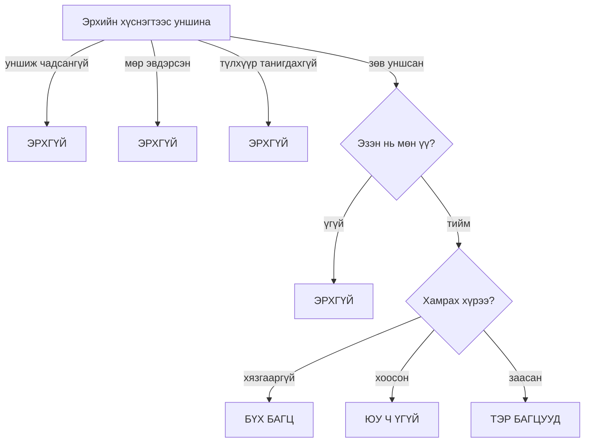
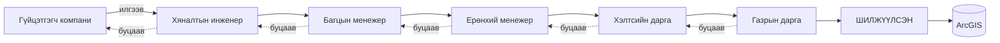

# 05 · Эрх, батлах урсгал, бичилт

Хэн юуг харах, хэн юуг засах вэ? Өгөгдөл ArcGIS руу хэрхэн буцаж бичигддэг вэ?

---

## 1. Эрх ГАНЦ хүснэгтэд

Порталын бүх эрх **нэг ArcGIS хүснэгтэд** хадгалагдана. Шинэ төрлийн эрх
нэмэхэд шинэ багана, шинэ хүснэгт үүсгэдэггүй — мөрийн угтвараар ялгана.

| Угтвар | Юуг заана |
|---|---|
| `__flow__:` | Гүйцэтгэлийн урсгалын шатны томилгоо |
| `__cap__:` | Засах эрх (мөр нэмэх, чанар, зөвшөөрөл, санхүү засах …) |
| `__qaqc__:` | Чанарын багцын хуваарилалт |
| `__huvaari__:` | Хуваарийн багцын хуваарилалт |
| `__obyem__:` | Обьёмын багцын хуваарилалт |
| `__ajil__:` | Нэмэлт ажлын багцын хуваарилалт |
| `__chanar__:` | Чанарын баримтын багцын хуваарилалт (ирүүлэгч · таван хянагч) |
| `__butets__:` | Дэд бүтцийн засварын багцын хуваарилалт |
| `__type__:` | Эрхийн төрлийн загвар (зөвхөн харагдац) |

⚠️ **Хүснэгтийн эзнийг шалгадаг.** Ижил нэртэй хүснэгт өөр хүн үүсгэж
болно. Систем зөвхөн зөвшөөрөгдсөн эзний хүснэгтийг хүлээж авна — эс бөгөөс
хэн ч ижил нэртэй хүснэгт үүсгээд өөртөө эрх бичиж чадна.

⚠️ **Эдгээр дүрмийг портал хөтөч дээр шалгадаг** — өгөгдлийн жинхэнэ хамгаалалт нь ArcGIS-ийн хуваалцалтын тохиргоо: [08 §8](08-hyzgaarlalt.md).

---

## 2. Эрхгүй гэж үзэх гурван тохиолдол — «хаалттай бол татгалзах»


```mermaid
flowchart TB
  READ[Эрхийн хүснэгтээс уншина]
  READ -->|уншиж чадсангүй| NO1[ЭРХГҮЙ]
  READ -->|мөр эвдэрсэн| NO2[ЭРХГҮЙ]
  READ -->|түлхүүр танигдахгүй| NO3[ЭРХГҮЙ]
  READ -->|зөв уншсан| OWN{Эзэн нь мөн үү?}
  OWN -->|үгүй| NO4[ЭРХГҮЙ]
  OWN -->|тийм| SCOPE{Хамрах хүрээ?}
  SCOPE -->|хязгааргүй| ALL[БҮХ БАГЦ]
  SCOPE -->|хоосон| NONE[ЮУ Ч ҮГҮЙ]
  SCOPE -->|заасан| SOME[ТЭР БАГЦУУД]
```

Систем эргэлзсэн тохиолдолд **үргэлж татгалзана**. Сүлжээ унасан,
тохиргоо эвдэрсэн, эсвэл танихгүй утга тааралдсан — бүгд «эрхгүй».

⚠️ **Яагаад ийм хатуу вэ:** эсрэгээр нь хийвэл сүлжээний түр тасалдал
бүгдэд бүх эрх нээнэ. Хатуу байдал нь заримдаа эвгүй боловч аюулгүй.

---

## 3. Хамрах хүрээ — гурван утга

| Тохиргоо | Утга |
|---|---|
| **Хязгааргүй** | Бүх багц |
| **Хоосон** | ⚠️ **ЮУ Ч БИШ** — «бүгд» ГЭСЭН ҮГ БИШ |
| **Заасан жагсаалт** | Зөвхөн тэр багцууд |

> ⚠️ Хамгийн түгээмэл буруу ойлголт нь **хоосон** тохиргоо. Хэрэглэгчид эрх
> олгоод багц сонгохоо мартвал тэр хүн **юу ч харахгүй**. «Эрх өгсөн атал
> ажиллахгүй байна» гэсэн гомдлын ихэнх шалтгаан энэ.

---

## 4. Гурван хяналт НЭГ кодоос

Хуваарь · Обьём · Чанар гурав нь **яг ижил бүтэцтэй** — ялгаа нь зөвхөн нэр.
Тиймээс тэдгээр нь нэг кодоос ажилладаг.

⚠️ **Яагаад чухал вэ:** урьд нь гурвуулаа тусдаа хуулбар байсан. Шалгалтаар
олдсон 13 алдааны **7 нь** нэг л хэв шинжтэй байв — засвар нь хуулбаруудын
**нэгд нь л** хүрч, бусад руу хуулагдаагүй. Одоо нэг газар зассан нь
гурвуулаад хүчинтэй.

⚠️ Гүйцэтгэлийн урсгал (§5) нь **энд ОРОХГҮЙ** — тэр нь шаттай бөгөөд
«нэг хүн нэг шатанд» гэсэн үндсэн өөр дүрэмтэй.

---

## 5. Гүйцэтгэлийн зургаан шатат урсгал


```mermaid
flowchart LR
  G[Гүйцэтгэгч компани] -->|илгээв| E[Хяналтын инженер]
  E --> M[Багцын менежер]
  M --> D[Ерөнхий менежер]
  D --> H[Хэлтсийн дарга]
  H --> C[Газрын дарга]
  C --> OK[ШИЛЖҮҮЛСЭН]
  OK --> A[(ArcGIS)]
  E -.буцаав.-> G
  M -.буцаав.-> E
  D -.буцаав.-> M
  H -.буцаав.-> D
  C -.буцаав.-> H
```

Шат бүр **зөвшөөрөх** эсвэл **буцаах** шийдвэр гаргана. Буцаасан бол
**нэг шат ухарч** өмнөх шатанд шалтгаантайгаа хамт эргэнэ (инженерийн
буцаалт л гүйцэтгэгч рүү очно).

⚠️ **Нэг аккаунт нэг шатанд.** Нэг хүн хоёр шатанд томилогдвол өөрийнхөө
шийдвэрийг өөрөө баталгаажуулах болно — систем үүнийг зөвшөөрөхгүй.

⚠️ **Шатны цорын ганц эх сурвалж нь ТОМИЛГОО.** Хэрэглэгчийн шат нь
түүний үүрэг биш, тухайн багцад томилогдсон эсэхээс тодорхойлогдоно.

---

## 6. Батлах хоёр шат — Хуваарь ба Обьём

Хуваарь, обьёмын өөрчлөлт нь шууд хүчин төгөлдөр болохгүй:

```
Зохиогч → илгээнэ → «хүлээгдэж буй» мөр үүснэ
Батлагч → шийднэ  → зөвшөөрвөл хүчин төгөлдөр
```

> ⚠️ **Зохиогч өөрийнхөө ажлыг батлаж ЧАДАХГҮЙ.** Систем илгээгч ба батлагч
> нэг хүн эсэхийг **хоёр удаа** шалгана: илгээхийн өмнө, мөн бичихийн өмнө
> сервер дээрх бодит утгаар. Тиймээс нэг хүнд «засах» ба «батлах» эрхийг
> хамт өгвөл тэр хүн юу ч батлаж чадахгүй болно.

Хүлээгдэж буй мөр нь өөрчлөлтийн бүрэн агуулгыг хадгална — батлагч
юу өөрчлөгдөхийг **бүтнээр** харж байж шийднэ.

### 6.1 Хуваарийн батлалтын нарийн дүрэм (2026-10-08)

- **Түгжээ ТӨРЛӨӨР.** Хуваарийн илгээлт хоёр төрөлтэй — **гэрээний** огноо ба
  **төлөвлөгөөний** огноо. Хүлээгдэж буй илгээлт зөвхөн ӨӨРИЙН төрлийн табыг
  түгжинэ: гэрээний санал хүлээж байхад төлөвлөгөө табыг засаж, илгээж болно
  (мөн эсрэгээр). Давхардлын шалгалт ч (багц · төрөл)-өөр
  (`huvaariBatlah.loadPending(pkg, kind)`).
- **Хагас бичилтийн тэмдэг.** Батлагч эх хуудсанд бичихээс ӨМНӨ илгээлтийн
  мөрөнд «хагас бичигдсэн» тэмдэг тавина (`markPlanPartial` — төлөв ба
  түгжээг бичихийн өмнө ба дараа дахин уншиж баталгаажуулна). Тэмдэгтэй үед
  зохиогч **татах**, батлагч жирийн **буцаах** хаалттай — эх хуудсанд хагас
  суусан огноо «буцаагдсан» санал болон үлдэхээс сэргийлнэ. Тэмдэг ЗӨВХӨН
  сервер **тодорхой татгалзсан** (нэг ч мөр бичигдээгүй) үед арилна; хариу
  алдагдсан (timeout, сүлжээ) бол эхний багц суусан байж болох тул **үлдэнэ**.
  Батлах амжилттай болоход тэмдэг арилна.
- **«Гацсаныг буцаах»** (`returnStuckPlan`). Тэмдэгтэй илгээлтийг батлагч
  гүйцээж чадахгүй бол (агшин солигдсон, мөр алга, эрх хасагдсан) шалтгаантай
  буцаана — мөр «буцаагдсан» болж, шалтгаан нь «хуудсанд бичигдсэн огноо хэвээр»
  гэсэн угтвартай тул зохиогч юу орсныг мэдэж засна. Эх хуудсанд юу ч бичихгүй.
  Өөр батлагчийн хүчинтэй түгжээтэй бол хаалттай; тэмдэггүй илгээлтэд энэ зам
  хаалттай (жирийн «Буцаах»).
- **Зохиогчид ил.** Цэсний «Хуваарь» тэмдэг нь **«буцаагдсан N»** — зохиогчид
  буцаагдсан илгээлтийн тоо (бусад харагдацын «N хүлээгдэж байна»-аас ялгаатай).
  Зохиогч өөрийн илгээлтийг хэн түгжиж байгаа, хагас бичигдсэн эсэхийг харна.
- **Хяналтад «Өөрчлөлт N» самбар.** Батлагч суурьтай зөрсөн мөрүүдийг (өөрчлөгдсөн
  блокийн чиптэй) жагсаалтаар харж, мөр бүр рүү үсэрч, бүлгээр ✓ тэмдэглэнэ.

---

## 7. Бичилт — өгөгдөл ArcGIS руу буцах

Порталаас ArcGIS руу бичдэг **18** зам бий. Тус бүр нь бичилт амжилттай
болсныг баталгаажуулж, дараа нь холбогдох дэлгэцүүдэд «шинэчил» гэж
мэдэгдэнэ ([03 §3.2](03-ogogdliin-zam.md)).

### 7.1 ⚠️ Хагас нийтлэлийн эрсдэл

Бөглөх хуудас нийтлэхэд мөрүүд **500-гийн багцаар** илгээгдэнэ.

> **Буцаах хамгаалалт нь зөвхөн НЭГ багцын дотор ажиллана.**
>
> 3,000 мөр нийтлэхэд 4 дэх багц дээр сүлжээ тасарвал:
> - Систем «амжилтгүй» гэж хэлнэ
> - Гэвч эхний **1,500 мөр ArcGIS-д аль хэдийн бичигдсэн** байна
>
> Энэ тохиолдолд өгөгдлийг **гараар шалгах** шаардлагатай. Систем үүнийг
> нуухгүй — нийтлэлийн үр дүнд хэдэн мөр бичигдсэнийг ил харуулна.

⚠️ Энэ бол ArcGIS-ийн үйлчилгээний хязгаарлалт, порталын алдаа биш.
Хамгийн найдвартай арга: **бага багаар, олон удаа** нийтлэх.

### 7.2 Бичилт амжилтгүй болбол

Кэш **хөдөлгөөнгүй** үлдэнэ — дэлгэц дээрх тоо хуучин хэвээр. Энэ нь
санаатай: амжилтгүй бичилтийн дараа дахин татах нь сайн өгөгдлийг
дэмий солино.

---

## 8. Хэн юуг бичиж чадах вэ

| Юу | Хаанаас | Ямар эрх шаардлагатай |
|---|---|---|
| Гүйцэтгэл бөглөх | Гүйцэтгэл | Багцад томилогдсон байх |
| Гүйцэтгэл батлах | Гүйцэтгэл | Шатны томилгоо (инженер / менежер / захирал) |
| Хуваарь засах | Хуваарь | Хуваарийн эрх + багц |
| Хуваарь батлах | Хуваарь | Батлах эрх (засах эрхээс **тусдаа**) |
| Обьём засах / батлах | Гүйцэтгэл | Обьёмын эрх + багц, батлах нь тусдаа |
| Чанарын баримт | Чанар | Чанарын эрх + багц |
| Зөвшөөрөл | Зөвшөөрөл | Зөвшөөрлийн эрх |
| Газрын талбарын төлөв | Газар чөлөөлөлт | Газрын эрх |
| Дэд бүтцийн атрибут | Инженерийн дэд бүтэц | Дэд бүтцийн эрх |
| Мөнгөн урсгалын төлөвлөгөө | Санхүүжилт | Санхүү засах эрх |
| ХАБЭА-ийн бүртгэл (зааварчилгаа · мэдэгдэх · сануулах хуудас · хог хаягдал), үзлэгийн тайлан татах | ХАБЭА | `habeaData` — батлагчгүй, багцаар хуваарилагдахгүй |
| Мөр нэмэх | Гүйцэтгэл | Тусгай эрх — ⚠️ бүтэц өөрчилдөг тул эрсдэлтэй |

⚠️ «Мөр нэмэх» нь хуудасны бүтцийг өөрчилдөг тул **бүх жин, мөнгөн дүн
дахин бодогдоно**. Тиймээс энэ нь үүрэгт автоматаар дагалддаггүй, нэг
бүрчлэн олгогддог.

---

## 9. Админ портал — харах ба засах эрх ТУСДАА

Админ портал (зөвхөн super) хажуугийн цэстэй. **Харах** ба **засах** эрх
хоёр өөр газраас олгогдоно:

| Цэс | Юу тохируулна | Хадгалалт |
|---|---|---|
| Тойм | Багц × системийн матриц, хүн бүрийн эрх, гацааны анхааруулга | шууд |
| Хэрэглэгчдийн эрх удирдах | **Зөвхөн харах**: аккаунт · үүргийн шошго · 17 харах хуудас · ТЭЗҮ-БОНУ | ноорог → «Хадгалах» |
| Эрхийн төрөл | Төрөл бүрийн харагдац · ТЭЗҮ-БОНУ · нүүр цонх · админ самбар (засах эрх ОРОХГҮЙ) | шууд |
| Гүйцэтгэлийн урсгалын эрх | Зургаан шат × багц | шууд |
| Засах эрх — 9 хуудас | Урсгал бүр өөрийн хуудастай (доор) | шууд |

Засах эрхийн 9 хуудас (**нэг урсгал = нэг хуудас** — зохиогч ба батлагч
нэг хуудсанд). Багцаар олгодог хуудсууд ба «Гүйцэтгэлийн урсгалын эрх» нь
**«багц × үүрэг» хүснэгт** (мөр = багц, багана = үүрэг/шат): нүд бүрд тэр
багцын тэр үүргийн аккаунтууд, «+»-ээр нэмж ✕-ээр хасна. «Бүх багц»-тай
аккаунт мөр бүрд бүдэг харагдана; нэг мөрөөс хасвал бусад багцын ил жагсаалт
болно (асууна). Гацах нүд (батлагч/хянагчгүй, зохиогч өөрөө л батлагч) бүдэг
шар, мөрийн толгойд ⚠. Хадгалалт аккаунтаар хэвээр:

| Хуудас | Үүрэг | Хэрхэн олгоно |
|---|---|---|
| Хуваарийн эрх | Зохиогч · Батлагч | багцаар |
| Нэмэлт ажлын эрх | Мөр нэмэгч · Батлагч | багцаар |
| Инженерийн обьёмын эрх | Засварлагч · Батлагч | багцаар |
| Чанарын баримтын эрх | Ирүүлэгч · ТУХ · Чанар · ХАБЭА · ТУГ · ЧХ инженер | багцаар |
| Чанарын (QAQC) эрх | ITP бөглөгч | багцаар |
| Инженерийн дэд бүтцийн засварын эрх | Засварлагч | багцаар |
| Зөвшөөрөл засах | — | аккаунтаар |
| Санхүүгийн бүртгэлийн эрх | «утга засах» ба «мөр нэмэх, устгах» — хоёр хэсэг | аккаунтаар |
| Газрын төлөв засах | — | аккаунтаар |

⚠️ **Урсгалтай 6 хуудас хэрэглэгчийн картын «Харагдац» жагсаалтад ОРОХГҮЙ:**
Гүйцэтгэл · Хуваарь · Хуваарь батлах · Нэмэлт ажил батлах · Чанарын баримт ·
Чанар (QAQC). Тэдгээр нь урсгалын хуваарилалт олгоход автоматаар нээгдэж,
хасахад хаагдана (`CAP_HOST_VIEW`, урсгалын шат). «Бүгдийг асаах/унтраах» ба
«Эрхийн төрөл» загвар тэдгээрийг хөндөхгүй. Бусад засах эрхийн харагдац
(зөвшөөрөл · санхүү · газар · дэд бүтэц) картад бүдэг унтраалгаар харагдана —
хаах бол тухайн эрхийн хуудсанд эрхийг нь хасна.

⚠️ **Багцаар олгогддог эрх шууд унтраалгаар олгогдохгүй** — эрх нь
хуваарилалтын тусгал. Хуваарилалтгүй атлаа асаалттай (өнчин) эрх тухайн
хуудсанд улаанаар харагдаж, ил «хасах»-аар л арилна. Хатуу super-т
хуваарилалт үйлчилдэггүй тул түүнд эрхийг мөн тэр хуудсанд шууд олгоно.

⚠️ «Төрлөөр тохируулах» нь **зөвхөн харагдац** солино — засах эрхийг
хөндөхгүй (2026-09-30-ны шийдвэр).

---

## 10. Зэрэг ажиллах — түгжээ, гацалт, зөрчил (2026-10-09)

ArcGIS-д **нөхцөлт update байхгүй**. Тиймээс хоёр хүн нэг мөрд зэрэг бичихэд
«сүүлд бичсэн нь ялна» — доорх замууд үүнийг ил болгож, хаана боломжтой бол
түгжинэ. Завсар маш богино, гэхдээ тэг биш.

### 10.1 Нэмэлт ажлын батлалт — `casAjilClaim`

Батлагч шийдвэр гаргахын өмнө `pending` мөрийг **атомаар түгжинэ** (CAS):
(1) дахин уншина — төлөв зөв, өөр хүний/табын хүчинтэй түгжээгүй; (2) тэмдгээ
бичнэ; (3) дахин уншиж ЯГ өөрийн тэмдэг үлдсэнийг батална — зэрэг бичсэн хүн
ялсан бол түүний нэрийг хэлнэ. Түгжээтэй үед өөр батлагчийн шийдвэр, зохиогчийн
татах/засах татгалзана. Шийдвэрийн бичилт тэмдгийг өөрөө арилгана. Буцаалт
(`approved` мөрд) ч мөн түгжээг эхэлж авна. Урьд нь хоёр батлагчийн шийдвэр
чимээгүй бие биеэ дардаг байв.

### 10.2 Обьёмын батлалт — «завгүй» · «хагас бичигдсэн» · «Гацсаныг буцаах»

- Батлагч эхлээд үндсэн өгөгдөлд (`applyUpdates`), дараа нь илгээлтийг
  `approved` болгодог. Завсарт унавал `pending` мөрд **хагас бичигдсэн тэмдэг**
  (`PARTIAL_MARK`) үлдэнэ — хугацаагүй, зөвхөн амжилттай батлахад арилна.
  Тэмдэгтэй үед зохиогчийн татах ба жирийн «Буцаах» хаалттай; «Батлах» (бичилтийг
  гүйцээх) нээлттэй.
- **`obyemBusyFor`**: багцын обьём батлагчийн түгжээтэй эсвэл хагас бичигдсэн
  үед нэмэлт ажил буулгахыг хаана (эс бөгөөс обьём хуучин жаазад бууна).
  Уншилт унавал fail-closed — бичихгүй.
- **«Гацсаныг буцаах»** (`returnStuckObyem`, хуваарийн `returnStuckPlan`-ийн
  загвар): батлагч бичилтийг гүйцээж чадахгүй бол (жааз солигдсон, мөр алга,
  эрх хасагдсан) батлагч эсвэл super шалтгаан бичээд `returned` болгоно.
  Шалтгаан нь угтвартай тул зохиогч үндсэн өгөгдөлд юу орсныг мэдэж засна.
  Үндсэн өгөгдөлд юу ч бичихгүй. Өөр батлагчийн хүчинтэй түгжээтэй бол хаалттай.

### 10.3 Чанар (QAQC) — хадгалахын өмнөх зөрчлийн шалгалт

`saveQaqc` нөхцөлгүй `updates` илгээдэг тул хадгалахын ӨМНӨ хөндөх мөрүүдийг
серверээс **дахин уншина** (`qaqcConflicts`). Нүдний суурь (засах үед харсан
утга)-аас серверт ӨӨРЧЛӨГДСӨН нүдийг бичихгүй — хадгалаагүй засвар хэвээр
үлдэж, нэрлэгдэнэ. Сервер аль хэдийн ижил утгатай бол зөрчил биш. Серверт
устгагдсан мөрийн засварыг хадгалахгүй, булшилж хасна. Талбарын уртаас хэтэрсэн
утгыг таслахгүй — хадгалахын өмнө анхааруулна.

### 10.4 Гүйцэтгэл бөглөх — хоёр хүн нэг багцыг зэрэг

Ноорог нүд бүрээр **LWW** (сүүлд бичсэн нь ялна, `mergeDrafts`) — энэ дүрэм
өөрчлөгдөөгүй; доорх нь зөвхөн юу болсныг ИЛ хэлж, эзэмшлийг зөв тавина
([`draft.ts`](../../src/modules/sheet/fill/draft.ts),
[`useDraftSync.ts`](../../src/modules/sheet/fill/useDraftSync.ts)):

- **Илгээлтийн баримт (receipt).** Нэг хүн илгээхэд «юу илгээгдсэн» баримт
  ноорогт үлдэнэ. Нөгөө табын татах мөчлөг ШИНЭ баримт олбол илгээлтийг дахин
  уншина — илгээгдсэн нүд дахин орж ДАВХАР тоологдохгүй; илгээлтээс өмнөх
  хувилбараас үргэлжилсэн засвар зөрүү болж анхааруулна.
- **Нүдний цаг (HLC).** Шинэ гараар засвар тухайн нүдэнд харсан хамгийн хожуу
  алсын агшнаас ҮРГЭЛЖ хожуу тамгалагдана — өөр хүний буцаалтыг харсны дараа
  бичсэн утга «эрт» гэж хасагдахгүй.
- **Эзэмшил.** Өөр хүн миний нүдийг хожуу дарж бичвэл нүд түүнийх болно
  (тайлбар ба «Илгээх» хүлээлт зөв).
- **Мэдэгдэл.** «{нэр} таны бөглөсөн нүдийг өөрчиллөө» — нүд бүрд нэг удаа,
  нүд богино тодорно. «Илгээх»-ийн өмнө алсыг дахин шалгана.

---

**Дараагийн алхам:** [06 · Тоог зөв ойлгох](06-toonii-dursam.md) ·
[08 · Хязгаарлалт](08-hyzgaarlalt.md)

---

**Хамгийн сүүлд шинэчилсэн:** 2026-10-09
**Автомат шалгуур:** байхгүй — эрхийн логикийг `aclParity` болон
`huvaariBatlah` зэрэг кодын шалгуурууд хамгаалдаг
**Гараар шалгах:** бичих замын тоо (18), багцын хэмжээ (500)
