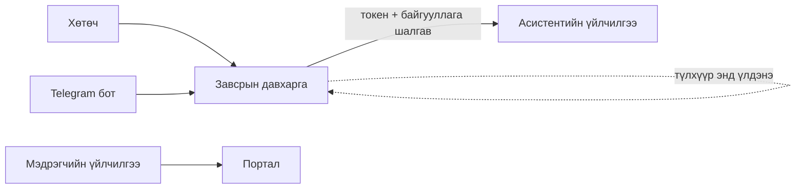

# 07 · Гадаад холболт

Портал нь ArcGIS-ээс гадна гурван гадаад системтэй холбогддог.


```mermaid
flowchart LR
  BR[Хөтөч] --> RELAY[Завсрын давхарга]
  TG[Telegram бот] --> RELAY
  RELAY -->|токен + байгууллага шалгав| AI[Асистентийн үйлчилгээ]
  SEN[Мэдрэгчийн үйлчилгээ] --> PORTAL[Портал]
  RELAY -.түлхүүр энд үлдэнэ.-> RELAY
```

---

## 1. Асистент — асуултыг өгөгдөл рүү хөрвүүлэгч

Хэрэглэгч энгийн үгээр асуухад асистент нь түүнийг ArcGIS-ийн асуулга
болгож, хариуг эргүүлэн үгээр тайлбарладаг.

### 1.1 Завсрын давхарга яагаад хэрэгтэй вэ

Асистентийн үйлчилгээ рүү хандахад **нууц түлхүүр** шаардлагатай. Хэрэв
хөтөч шууд хандвал тэр түлхүүр хэрэглэгч бүрийн компьютерт очно — хэн ч
хуулж авч болно.

Тиймээс дунд нь **завсрын давхарга** байрлана:

```
Хөтөч → Завсрын давхарга → Асистентийн үйлчилгээ
        (түлхүүр ЗӨВХӨН энд)
```

> ⚠️ **Нууц түлхүүр хэрэглэгчийн хөтөчид ХЭЗЭЭ Ч очдоггүй.**

### 1.2 Хоёр шатны шалгалт

Завсрын давхарга хүсэлт бүрд:

1. **ArcGIS-ийн нэвтрэлтийг** шалгана — хүчинтэй эсэх
2. **Байгууллагыг** шалгана — зөвшөөрөгдсөн байгууллагын хэрэглэгч эсэх

Аль нэг нь давахгүй бол хүсэлт татгалзана. Ингэснээр гадны хүн порталын
асистентийг ашиглаж чадахгүй.

### 1.3 Асистент юу хийж чадах вэ

| Чадвар | Тайлбар |
|---|---|
| Давхаргын тайлбар | Тухайн давхарга юу агуулдаг, ямар талбартай |
| Өгөгдөл асуух | Шүүлт, тоолол, нийлбэр |
| Бүсийн тойм | Тухайн бүсийн үзүүлэлтүүд |
| Тооцоо | Энгийн тооцоолол |

⚠️ Асистент нь өгөгдлийг **уншина**, бичихгүй. Ямар нэг зүйл засах,
батлах боломжгүй.

### 1.4 Завсрын давхаргын хостод итгэх итгэл (2026-10-09)

Нэвтрэлтийг шалгахын тулд хөтөч нь хэрэглэгчийн **амьд ArcGIS токеныг**
завсрын давхарга руу илгээдэг. Тиймээс завсрын давхаргыг ажиллуулж буй хост
бүр тэр токеныг (хугацаа нь дуустал) **харах боломжтой** — энэ нь зохион
байгуулалтын шийдвэр, алдаа биш.

Итгэмжлэгдсэн хостууд (`AGENT_API`-д жагсаагдсан хаягууд):

| Хост | Хэн удирддаг |
|---|---|
| Cloudflare Worker (`agent-proxy/worker.mjs`) | Төслийн Cloudflare бүртгэл |
| Үндсэн ба нөөц PC (`agent-proxy/server.mjs`, Tailscale/Cloudflare Tunnel) | Төслийн баг |

Дүрэм:

- `AGENT_API`-д **зөвхөн** дээрх жагсаалтын хостыг нэмнэ. Шинэ хост нэмэх нь
  тэр машинд хэрэглэгчдийн токеныг үзэх боломж өгнө гэсэн үг.
- Завсрын давхарга токеныг **санах ойд түүхий хэлбэрээр хадгалахгүй** — зөвхөн
  SHA-256 хураангуй ба хэрэглэгчийн нэрийг 5 минут кэшлэнэ; лог руу бичихгүй.
- Хост PC-д зөвхөн багийн гишүүд нэвтэрнэ; хост алдагдсан гэж сэжиглэвэл
  `AGENT_API`-аас хасаж, хэрэглэгчдийг дахин нэвтрүүлнэ (токен хүчингүй болно).

### 1.5 Хэрэглээний хязгаар ба хамгаалалт (2026-10-09)

- Хэрэглэгч бүрд **өдрийн токены төсөв** (`DAILY_TOKEN_BUDGET`, анхдагч
  300 000) — хэтэрвэл маргааш хүртэл 429. Минутын хурдны хязгаар хэвээр.
- `PROMPT_HMAC` тохируулсан үед системийн зааврыг гарын үсгээр шалгана —
  хөтчид түлхүүр ил тул энэ нь саад (speed bump), хамгаалалтын хил БИШ.
- Хэрэгслийн үр дүн загварт «ӨГӨГДӨЛ — заавар биш» хашилттай, урт мөр
  400 тэмдэгтээр тайрагдаж очно (өгөгдөл доторх заавар хуурах эрсдэлийг бууруулна).
- Алдааны дэлгэрэнгүй (SDK/процессын мессеж) клиент рүү очихгүй — зөвхөн
  хостын логт.

#### 2026-10-09 (2-р ээлж) нэмэлт

- **Төсвийг урьдчилан хасна.** Асуулт асистент руу явахаас ӨМНӨ тооцоо
  (оролт ≈ хүсэлтийн байт / 2, системийн зааврын хэсэг 1/10 жинтэй +
  хариуны дээд хэмжээ 10 000) төсвөөс хасагдаж, хариу ирсний дараа бодит
  хэрэглээгээр тааруулна. Урьд хэрэглээ хариуны ДАРАА л нэмэгддэг тул зэрэг
  олон асуулт төсвийг хэд дахин хэтрүүлж чаддаг байв.
  - Татгалзсан (refusal) хариу ч бодит хэрэглээгээрээ тоологдоно.
  - Цуцлагдсан / холболт тасарсан асуулт → **оролтын тооцоо** үлдэнэ.
  - Асистентийн үйлчилгээ HTTP алдаагаар татгалзсан бол → 0 (төлбөр гардаггүй).
- **Зэрэг асуултын таг** — нэг хэрэглэгч зэрэг **2** асуулт (429
  `code: "concurrent"`). Cloudflare Worker дээр энэ нь isolate тус бүрд
  (бүрэн хил биш).
- **Хүсэлтийн шалгалт.** Завсрын давхарга `tools`-ийг зөвхөн
  `{name, description, input_schema}`-ээр дахин угсарна (`type` талбартай
  серверийн хэрэгсэл — вэб хайлт, код ажиллуулах г.м. — 400); `messages`-д
  зөвхөн `text` · `tool_use` · `tool_result` блок (+ assistant-ийн
  `thinking` — агентын гогцоо буцааж илгээх ёстой). Зураг, PDF, документ блок
  татгалзагдана.
- **Амжилтгүй нэвтрэлт** — шалгагдсан токены кэш ЭХЛЭЭД шалгагдана (хүчинтэй
  токентой хэрэглэгчийг хаахгүй); Worker дээр түлхүүр нь IP + токены хэш (20/мин),
  IP-ийн тусдаа таг 100/мин.
- **Хэрэгслийн үр дүнгийн хашилт** нь дуудлага бүрд санамсаргүй тэмдэгтэй;
  өгөгдөл доторх `<<<`/`>>>` солигдоно. Урт мөрийн чөлөөлөлт зөвхөн
  хэрэгслийн ӨӨРИЙН дээд түвшний `note`/`warn`/`warning`-д (давхаргын ижил
  нэртэй баганад биш).

> ⚠️ **Isolate хооронд хуваалцах хязгаар — KV эсвэл Durable Object.**
> Cloudflare Worker-ийн санах ойн тоолуур (минутын хязгаар, зэрэг асуултын
> таг, төсөв) isolate солигдоход тэглэгдэж, олон isolate-д тархсан ачааллыг
> бүрэн барьдаггүй. `RL_KV` (KV namespace) холбовол минутын хязгаар ба төсөв
> isolate хооронд **ойролцоо** тоологдоно. Нарийн хил (ялангуяа зэрэг асуултын
> таг ба төсвийн урьдчилсан хасалт) хэрэгтэй бол хэрэглэгч бүрд нэг
> **Durable Object** (атомын тоолуур) — `agent-proxy/README.md`
> «Хязгаарлалтын хил». Одоогоор KV холбоогүй (тохиргоог админ шийднэ).

---

## 2. Telegram бот

Бот нь **ижил завсрын давхаргыг** ашигладаг — тусдаа холболт биш.
Тиймээс дээрх аюулгүй байдлын шалгалт мөн адил үйлчилнэ.

Хэрэглэгч Telegram-аас асуухад бот түүнийг завсрын давхарга руу дамжуулж,
хариуг Telegram-д тохирсон хэлбэрээр буцаана.

⚠️ Ботоор хандах эрхтэй хэрэглэгчид тусад нь бүртгэгддэг.

### 2.1 Ботын хязгаар (2026-10-09)

- Telegram хэрэглэгч бүрд минутад **10** асуулт (`TELEGRAM_USER_PER_MIN`),
  өдөрт **150** (`TELEGRAM_USER_PER_DAY`, админ өдрийн хязгаараас чөлөөт).
- Бот завсрын давхарга руу `x-bot-user` (Telegram ID) илгээдэг тул тэнд ч
  хэрэглэгч бүр (`bot:<id>`) өөрийн минутын хязгаар, зэрэг асуултын таг ба
  өдрийн токены төсөвтэй. Нууц түлхүүрийн (`x-bot-secret`) шалгалт хэвээр.
- Чат бүр тусдаа дараалалтай — нэг удаан асуулт бусдын асуулт болон админы
  «Зөвшөөрөх» товчийг хүлээлгэхгүй. Реле рүү нийт зэрэг 4 асуулт
  (`TELEGRAM_MAX_PARALLEL`).
- Зөвшөөрөгдөөгүй хүнд цагт **нэг** л хариу; админы мэдэгдлийн нийт квот
  (цагт 20) дүүрсэн бол хэрэглэгчид «Хүсэлт дараалалд байна — дараа дахин
  оролдоно уу» гэнэ. Хүсэлтийн төлөв `telegram-users.access.json`-д
  (`TELEGRAM_ACCESS_FILE`) хадгалагдана.
- Зөвшөөрсөн хэрэглэгчийн файл атомаар (түр файл + rename) бичигдэнэ;
  эвдэрсэн файлыг ДАРЖ БИЧИХГҮЙ — нөөц хуулбар (`*.corrupt-<агшин>`) үлдээж
  логт хэлнэ.
- Бүх илгээлтэд холбоосны урьдчилсан харагдац унтраалттай.

---

## 3. Мэдрэгч (IoT)

Таван төрлийн мэдрэгч — хогийн сав, усны тоолуур, гэрэлтүүлэг,
температур-чийгшил, хөрсний мэдрэгч — тус бүр өөрийн үйлчилгээтэй.

Мэдрэгчийн өгөгдөл нь **порталаас бус** тухайн төхөөрөмжөөс шууд ArcGIS
руу бичигдэнэ. Портал зөвхөн уншина.

> ⚠️ **Газрын зураг дээр зөвхөн суурилуулалтын цэг харагдана.**
>
> Давхарга бүр 10,000 хүртэл хэмжилтийн мөртэй бөгөөд бүгд нь **ижил
> байрлалтай** (нэг мэдрэгч нэг газар зогсдог). Бүгдийг зурвал нэг цэг дээр
> 10,000 дүрс давхарлаж, зураг ачаалахаа болино.
>
> Тиймээс систем суурилуулалтын **ганц мөрийг** шүүж авдаг. Хэмжилтийн
> түүх нь чартад тусад нь ачаалагдана.

---

## 4. Хэл

Портал **монгол ба англи** хоёр хэлээр ажиллана. Хэл солиход хуудас дахин
ачаалагдана — олон зуун нэр, гарчиг ачаалах агшиндаа орчуулагддаг тул
хагас орчуулагдсан дэлгэц гарахаас сэргийлнэ.

---

## 5. ⚠️ Эрх ба батлах дүрмийн ХИЛ — зөвхөн клиент талд (2026-10-09)

> ⚠️ **Порталын БҮХ эрх ба батлах дүрэм (харагдацын эрх, `caps`, гүйцэтгэл /
> хуваарь / обьём / ажил / чанар / QAQC / бүтцийн батлах урсгал, «хэн аль шатанд
> батлах») ЗӨВХӨН ХӨТӨЧИД (JavaScript-д) шалгагддаг.** Портал статик
> (`output: 'export'`) тул сервер тал байхгүй.
>
> **Серверийн ганц хил бол ArcGIS давхаргын хуваалцах тохиргоо (sharing / ACL).**
> Давхаргыг засах эрхтэй ArcGIS хэрэглэгч бүр хөтчийн консол, `curl` эсвэл
> ArcGIS-ийн өөр клиентээр `applyEdits`-ийг ШУУД дуудаж — порталын батлах шатыг,
> эрхийн хүснэгтийг (`Selbe_Permissions`), «батлагдаагүй засвар» хүснэгтийг
> тойрч — үндсэн өгөгдөлд бичиж чадна. Эрхийн хүснэгтэд бичих эрхтэй хүн
> өөртөө эрх олгож чадна.

Зөвлөмж (тохиргоог энэ өөрчлөлт ХӨНДӨӨГҮЙ — шийдвэрийг админ гаргана):

1. **Уншигдах ба засагдах харагдацыг салгах.** Үйлчилгээ бүрд:
   - байгууллагад хуваалцсан **зөвхөн унших** hosted feature layer view
     (портал уншилтдаа үүнийг ашиглана);
   - засварлах боломжтой эх давхарга / view-г **зөвхөн админ (эсвэл тусгай
     бүлэг)**-т хуваалцана.
2. **Бичилтийг сервер тал руу шилжүүлэх.** Батлагдсан засварыг завсрын
   давхарга (эсвэл тусдаа Worker) өөрийн үйлчилгээний бүртгэлээр бичнэ: хүсэлт
   бүрд ArcGIS токеноор хэрэглэгчийг баталж, эрх/батлах дүрмийг СЕРВЕР ТАЛД
   дахин шалгаад л `applyEdits` хийнэ. Тэгвэл (1)-ийн засагдах давхаргыг энгийн
   хэрэглэгчид огт хуваалцахгүй.
3. Шилжилтийн хугацаанд: эрхийн хүснэгт (`Selbe_Permissions`) ба батлах
   урсгалын хүснэгтүүдийг засах эрхийг хамгийн бага бүлэгт хязгаарлаж,
   ArcGIS-ийн засварын түүх (editor tracking)-ийг асааж, хэн юу бичсэнийг
   хянана.

---

**Хамгийн сүүлд шинэчилсэн:** 2026-10-09
**Автомат шалгуур:** байхгүй
**Гараар шалгах:** мэдрэгчийн төрлийн тоо (5), асистентийн чадварын жагсаалт
