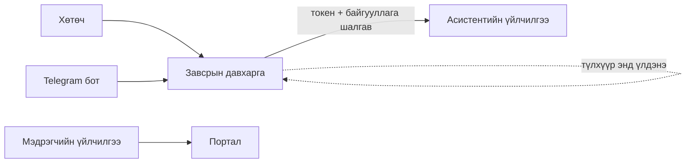

# 07 · Гадаад холболт

Портал нь ArcGIS-ээс гадна гурван гадаад системтэй холбогддог.


```mermaid
flowchart LR
  BR[Хөтөч] --> RELAY[Завсрын давхарга]
  TG[Telegram бот] --> RELAY
  RELAY -->|токен + байгууллага шалгав| AI[Асистентийн үйлчилгээ]
  SEN[Мэдрэгчийн үйлчилгээ] --> PORTAL[Портал]
  RELAY -.түлхүүр энд үлдэнэ.-> RELAY
```

---

## 1. Асистент — асуултыг өгөгдөл рүү хөрвүүлэгч

Хэрэглэгч энгийн үгээр асуухад асистент нь түүнийг ArcGIS-ийн асуулга
болгож, хариуг эргүүлэн үгээр тайлбарладаг.

### 1.1 Завсрын давхарга яагаад хэрэгтэй вэ

Асистентийн үйлчилгээ рүү хандахад **нууц түлхүүр** шаардлагатай. Хэрэв
хөтөч шууд хандвал тэр түлхүүр хэрэглэгч бүрийн компьютерт очно — хэн ч
хуулж авч болно.

Тиймээс дунд нь **завсрын давхарга** байрлана:

```
Хөтөч → Завсрын давхарга → Асистентийн үйлчилгээ
        (түлхүүр ЗӨВХӨН энд)
```

> ⚠️ **Нууц түлхүүр хэрэглэгчийн хөтөчид ХЭЗЭЭ Ч очдоггүй.**

### 1.2 Хоёр шатны шалгалт

Завсрын давхарга хүсэлт бүрд:

1. **ArcGIS-ийн нэвтрэлтийг** шалгана — хүчинтэй эсэх
2. **Байгууллагыг** шалгана — зөвшөөрөгдсөн байгууллагын хэрэглэгч эсэх

Аль нэг нь давахгүй бол хүсэлт татгалзана. Ингэснээр гадны хүн порталын
асистентийг ашиглаж чадахгүй.

### 1.3 Асистент юу хийж чадах вэ

| Чадвар | Тайлбар |
|---|---|
| Давхаргын тайлбар | Тухайн давхарга юу агуулдаг, ямар талбартай |
| Өгөгдөл асуух | Шүүлт, тоолол, нийлбэр |
| Бүсийн тойм | Тухайн бүсийн үзүүлэлтүүд |
| Тооцоо | Энгийн тооцоолол |

⚠️ Асистент нь өгөгдлийг **уншина**, бичихгүй. Ямар нэг зүйл засах,
батлах боломжгүй.

### 1.4 Завсрын давхаргын хостод итгэх итгэл (2026-10-09)

Нэвтрэлтийг шалгахын тулд хөтөч нь хэрэглэгчийн **амьд ArcGIS токеныг**
завсрын давхарга руу илгээдэг. Тиймээс завсрын давхаргыг ажиллуулж буй хост
бүр тэр токеныг (хугацаа нь дуустал) **харах боломжтой** — энэ нь зохион
байгуулалтын шийдвэр, алдаа биш.

Итгэмжлэгдсэн хостууд (`AGENT_API`-д жагсаагдсан хаягууд):

| Хост | Хэн удирддаг |
|---|---|
| Cloudflare Worker (`agent-proxy/worker.mjs`) | Төслийн Cloudflare бүртгэл |
| Үндсэн ба нөөц PC (`agent-proxy/server.mjs`, Tailscale/Cloudflare Tunnel) | Төслийн баг |

Дүрэм:

- `AGENT_API`-д **зөвхөн** дээрх жагсаалтын хостыг нэмнэ. Шинэ хост нэмэх нь
  тэр машинд хэрэглэгчдийн токеныг үзэх боломж өгнө гэсэн үг.
- Завсрын давхарга токеныг **санах ойд түүхий хэлбэрээр хадгалахгүй** — зөвхөн
  SHA-256 хураангуй ба хэрэглэгчийн нэрийг 5 минут кэшлэнэ; лог руу бичихгүй.
- Хост PC-д зөвхөн багийн гишүүд нэвтэрнэ; хост алдагдсан гэж сэжиглэвэл
  `AGENT_API`-аас хасаж, хэрэглэгчдийг дахин нэвтрүүлнэ (токен хүчингүй болно).

### 1.5 Хэрэглээний хязгаар ба хамгаалалт (2026-10-09)

- Хэрэглэгч бүрд **өдрийн токены төсөв** (`DAILY_TOKEN_BUDGET`, анхдагч
  300 000) — хэтэрвэл маргааш хүртэл 429. Минутын хурдны хязгаар хэвээр.
- `PROMPT_HMAC` тохируулсан үед системийн зааврыг гарын үсгээр шалгана —
  хөтчид түлхүүр ил тул энэ нь саад (speed bump), хамгаалалтын хил БИШ.
- Хэрэгслийн үр дүн загварт «ӨГӨГДӨЛ — заавар биш» хашилттай, урт мөр
  400 тэмдэгтээр тайрагдаж очно (өгөгдөл доторх заавар хуурах эрсдэлийг бууруулна).
- Алдааны дэлгэрэнгүй (SDK/процессын мессеж) клиент рүү очихгүй — зөвхөн
  хостын логт.

---

## 2. Telegram бот

Бот нь **ижил завсрын давхаргыг** ашигладаг — тусдаа холболт биш.
Тиймээс дээрх аюулгүй байдлын шалгалт мөн адил үйлчилнэ.

Хэрэглэгч Telegram-аас асуухад бот түүнийг завсрын давхарга руу дамжуулж,
хариуг Telegram-д тохирсон хэлбэрээр буцаана.

⚠️ Ботоор хандах эрхтэй хэрэглэгчид тусад нь бүртгэгддэг.

---

## 3. Мэдрэгч (IoT)

Таван төрлийн мэдрэгч — хогийн сав, усны тоолуур, гэрэлтүүлэг,
температур-чийгшил, хөрсний мэдрэгч — тус бүр өөрийн үйлчилгээтэй.

Мэдрэгчийн өгөгдөл нь **порталаас бус** тухайн төхөөрөмжөөс шууд ArcGIS
руу бичигдэнэ. Портал зөвхөн уншина.

> ⚠️ **Газрын зураг дээр зөвхөн суурилуулалтын цэг харагдана.**
>
> Давхарга бүр 10,000 хүртэл хэмжилтийн мөртэй бөгөөд бүгд нь **ижил
> байрлалтай** (нэг мэдрэгч нэг газар зогсдог). Бүгдийг зурвал нэг цэг дээр
> 10,000 дүрс давхарлаж, зураг ачаалахаа болино.
>
> Тиймээс систем суурилуулалтын **ганц мөрийг** шүүж авдаг. Хэмжилтийн
> түүх нь чартад тусад нь ачаалагдана.

---

## 4. Хэл

Портал **монгол ба англи** хоёр хэлээр ажиллана. Хэл солиход хуудас дахин
ачаалагдана — олон зуун нэр, гарчиг ачаалах агшиндаа орчуулагддаг тул
хагас орчуулагдсан дэлгэц гарахаас сэргийлнэ.

---

**Хамгийн сүүлд шинэчилсэн:** 2026-10-09
**Автомат шалгуур:** байхгүй
**Гараар шалгах:** мэдрэгчийн төрлийн тоо (5), асистентийн чадварын жагсаалт
